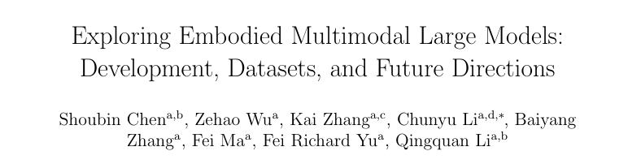

<p align="center">

</p>  

[](https://arxiv.org/abs/2502.15336)
[](https://github.com/BurryChen/Embodied-Multimodal-Large-Models)
## Paper list

###  Grouped by model categories:
todo:
###  Sorted by the sequence of our paper citations : 
1. R.     A. Brooks, Intelligence without representation, Artificial intelligence 47 (1-3) (1991) 139-159.\
[[paper](https://doi.org/10.1016/0004-3702(91)90053-M)]
2. F.     J. Varela,     E. Thompson,     E. Rosch, The embodied mind, revised edition: Cognitive science and human experience, MIT press, 2017.\
[[paper](https://books.google.com.hk/books?hl=zh-CN&lr=&id=bxLiDQAAQBAJ&oi=fnd&pg=PR7&dq=revised+edition:+Cognitive+science+and+human+experience&ots=LxXeoyVcvZ&sig=zBJjYFSDXyShJYSclrZW1nw-RP4&redir_esc=y#v=onepage&q=revised%20edition%3A%20Cognitive%20science%20and%20human%20experience&f=false)]
3. G. Lakoff,     M. Johnson,     J.     F. Sowa, Review of philosophy in the flesh: The embodied mind and its challenge to western thought, Computational Linguistics 25 (4) (1999) 631-634.\
[[paper](https://www.researchgate.net/profile/John-Sowa-2/publication/234791349_Review_of_Philosophy_in_the_flesh_the_embodied_mind_and_its_challenge_to_western_thought_by_George_Lakoff_and_Mark_Johnson_Basic_Books_1999/links/5f5a794b92851c07895d2bae/Review-of-Philosophy-in-the-flesh-the-embodied-mind-and-its-challenge-to-western-thought-by-George-Lakoff-and-Mark-Johnson-Basic-Books-1999.pdf)]
4. R.     A. Brooks,     C. Breazeal,     M. Marjanović,     B. Scassellati,     M.     M. Williamson, The cog project: Building a humanoid robot, in: International workshop on computation for metaphors, analogy, and agents, Springer, 1998, pp. 52-87.\
[[paper](https://link.springer.com/chapter/10.1007/3-540-48834-0_5#preview)]
5. W.     X. Zhao,     K. Zhou,     J. Li,     T. Tang,     X. Wang,     Y. Hou,     Y. Min,     B. Zhang,     J. Zhang,     Z. Dong, et al., A survey of large language models, arXiv preprint arXiv:2303.18223 (2023).\
[[paper](https://arxiv.org/abs/2303.18223)]
6. Y. Chang,     X. Wang,     J. Wang,     Y. Wu,     L. Yang,     K. Zhu,     H. Chen,     X. Yi,     C. Wang,     Y. Wang, et al., A survey on evaluation of large language models, ACM Transactions on Intelligent Systems and Technology 15 (3) (2024) 1-45.\
[[paper](https://dl.acm.org/doi/abs/10.1145/3641289)]
7. H. Naveed,     A.     U. Khan,     S. Qiu,     M. Saqib,     S. Anwar,     M. Usman,     N. Akhtar,     N. Barnes,     A. Mian, A comprehensive overview of large language models, arXiv preprint arXiv:2307.06435 (2023).\
[[paper](https://arxiv.org/abs/2307.06435)]
8. C. Li,     Z. Gan,     Z. Yang,     J. Yang,     L. Li,     L. Wang,     J. Gao, et al., Multimodal foundation models: From specialists to general-purpose assistants, Foundations and Trends, in Computer Graphics and Vision 16 (1-2) (2024) 1-214.\
[[paper](https://www.nowpublishers.com/article/Details/CGV-110)]
9. Y. Wu,     P. Zhang,     M. Gu,     J. Zheng,     X. Bai, Embodied navigation with multi-modal information: A survey from tasks to methodology, Information Fusion (2024) 102532.\
[[paper](https://www.sciencedirect.com/science/article/pii/S1566253524003105)]
10. H. Du,     L. Ren,     Y. Wang,     X. Cao,     C. Sun, Advancements in perception system with multi-sensor fusion for embodied agents, Information Fusion (2024) 102859.\
[[paper](https://www.sciencedirect.com/science/article/pii/S1566253524006377)]
11. Y. Liu,     W. Chen,     Y. Bai,     X. Liang,     G. Li,     W. Gao,     L. Lin, Aligning cyber space with physical world: A comprehensive survey on embodied ai, arXiv preprint arXiv:2407.06886 (2024).\
[[paper](https://arxiv.org/abs/2407.06886)]
12. N. Roy,     I. Posner,     T. Barfoot,     P. Beaudoin,     Y. Bengio,     J. Bohg,     O. Brock,     I. Depatie,     D. Fox,     D. Koditschek, et al., From machine learning to robotics: Challenges and opportunities for embodied intelligence, arXiv preprint arXiv:2110.15245 (2021).\
[[paper](https://arxiv.org/abs/2110.15245)]
13. R. Firoozi,     J. Tucker,     S. Tian,     A. Majumdar,     J. Sun,     W. Liu,     Y. Zhu,     S. Song,     A. Kapoor,     K. Hausman, et al., Foundation models in robotics: Applications, challenges, and the future, The International Journal of Robotics Research (2023) 02783649241281508.\
[[paper](https://journals.sagepub.com/doi/abs/10.1177/02783649241281508)]
14. J. Duan,     S. Yu,     H.     L. Tan,     H. Zhu,     C. Tan, A survey of embodied ai: From simulators to research tasks, IEEE Transactions on Emerging Topics in Computational Intelligence 6 (2) (2022) 230-244.\
[[paper](https://ieeexplore.ieee.org/abstract/document/9687596/)]
15. Z. Xi,     W. Chen,     X. Guo,     W. He,     Y. Ding,     B. Hong,     M. Zhang,     J. Wang,     S. Jin,     E. Zhou, et al., The rise and potential of large language model based agents: A survey, arXiv preprint arXiv:2309.07864 (2023).\
[[paper](https://link.springer.com/article/10.1007/s11432-024-4222-0)]
16. Y. Ma,     Z. Song,     Y. Zhuang,     J. Hao,     I. King, A survey on vision-language-action models for embodied ai, arXiv preprint arXiv:2405.14093 (2024).\
[[paper](https://arxiv.org/abs/2405.14093)]
17. S. Haddadin,     S. Parusel,     L. Johannsmeier,     S. Golz,     S. Gabl,     F. Walch,     M. Sabaghian,     C. Jähne,     L. Hausperger,     S. Haddadin, The franka emika robot: A reference platform for robotics research and education, IEEE Robotics & Automation Magazine 29 (2) (2022) 46-64.\
[[paper](https://ieeexplore.ieee.org/abstract/document/9721535/)]
18. C. Cui,     Y. Ma,     X. Cao,     W. Ye,     Y. Zhou,     K. Liang,     J. Chen,     J. Lu,     Z. Yang,     K.-D. Liao, et al., A survey on multimodal large language models for autonomous driving, in: Proceedings of the IEEE/CVF Winter Conference on Applications of Computer Vision, 2024, pp. 958- 979.\
[[paper](https://openaccess.thecvf.com/content/WACV2024W/LLVM-AD/html/Cui_A_Survey_on_Multimodal_Large_Language_Models_for_Autonomous_Driving_WACVW_2024_paper.html)]
19. A. Hubble,     J. Moorin,     A.     S. Khuman, Artificial intelligence in fps games: Npc difficulty effects on gameplay, in: Fuzzy Logic: Recent Applications and Developments, Springer, 2021, pp. 165-190.\
[[paper](https://link.springer.com/chapter/10.1007/978-3-030-66474-9_11)]
20. J.     S. Park,     J. O’Brien,     C.     J. Cai,     M.     R. Morris,     P. Liang,     M.     S. Bernstein, Generative agents: Interactive simulacra of human behavior, in: Proceedings of the 36th Annual ACM Symposium on User Interface Software and Technology, 2023, pp. 1-22.\
[[paper](https://dl.acm.org/doi/abs/10.1145/3586183.3606763)]
21. R. Kong,     Z. Qi,     S. Zhao, Difference between virtual idols and traditional entertainment from technical perspectives, in: 2021 3rd International Conference on economic Management and cultural industry (ICEMCI 2021), Atlantis Press, 2021, pp. 344-349.\
[[paper](https://www.atlantis-press.com/proceedings/icemci-21/125966274)]
22. J. Achiam,     S. Adler,     S. Agarwal,     L. Ahmad,     I. Akkaya,     F.     L. Aleman,     D. Almeida,     J. Altenschmidt,     S. Altman,     S. Anadkat, et al., Gpt-4 technical report, arXiv preprint arXiv:2303.08774 (2023).\
[[paper](https://arxiv.org/abs/2303.08774)]
23. J. Devlin, Bert: Pre-training of deep bidirectional transformers for language understanding, arXiv preprint arXiv:1810.04805 (2018).\
[[paper](https://arxiv.org/abs/1810.04805)]
24. C. Raffel,     N. Shazeer,     A. Roberts,     K. Lee,     S. Narang,     M. Matena,     Y. Zhou,     W. Li,     P.     J. Liu, Exploring the limits of transfer learning with a unified text-to-text transformer, Journal of Machine Learning Research 21 (140) (2020) 1-67.\
[[paper](http://jmlr.org/papers/v21/20-074.html)]
25. A. Radford, Improving language understanding by generative pretraining (2018).\
[[paper](https://www.mikecaptain.com/resources/pdf/GPT-1.pdf)]
26. Z. Yang, Xlnet: Generalized autoregressive pretraining for language understanding, arXiv preprint arXiv:1906.08237 (2019).\
[[paper](https://arxiv.org/abs/1906.08237)]
27. T.     B. Brown, Language models are few-shot learners, arXiv preprint arXiv:2005.14165 (2020).\
[[paper](https://arxiv.org/abs/2005.14165)]
28. A. Liu,     B. Feng,     B. Xue,     B. Wang,     B. Wu,     C. Lu,     C. Zhao,     C. Deng,     C. Zhang,     C. Ruan, et al., Deepseek-v3 technical report, arXiv preprint arXiv:2412.19437 (2024).\
[[paper](https://arxiv.org/abs/2005.14165)]
29. H. Touvron,     T. Lavril,     G. Izacard,     X. Martinet,     M.-A. Lachaux,     T. Lacroix,     B. Rozière,     N. Goyal,     E. Hambro,     F. Azhar, et al., Llama: Open and efficient foundation language models, arXiv preprint arXiv:2302.13971 (2023).\
[[paper](https://arxiv.org/abs/2302.13971)]
30. H. Touvron,     L. Martin,     K. Stone,     P. Albert,     A. Almahairi,     Y. Babaei,     N. Bashlykov,     S. Batra,     P. Bhargava,     S. Bhosale, et al., Llama 2: Open foundation and fine-tuned chat models, arXiv preprint arXiv:2307.09288 (2023).\
[[paper](https://arxiv.org/abs/2307.09288)]
31. K. He,     X. Zhang,     S. Ren,     J. Sun, Deep residual learning for image recognition, in: Proceedings of the IEEE Conference on Computer Vision and Pattern Recognition, 2016, pp. 770-778.\
[[paper](http://openaccess.thecvf.com/content_cvpr_2016/html/He_Deep_Residual_Learning_CVPR_2016_paper.html)]
32. A. Dosovitskiy, An image is worth 16x16 words: Transformers for image recognition at scale, arXiv preprint arXiv:2010.11929 (2020).\
[[paper](https://arxiv.org/abs/2010.11929)]
33. Z. Liu,     Y. Lin,     Y. Cao,     H. Hu,     Y. Wei,     Z. Zhang,     S. Lin,     B. Guo, Swin transformer: Hierarchical vision transformer using shifted windows, in: Proceedings of the IEEE/CVF International Conference on Computer Vision, 2021, pp. 10012-10022.\
[[paper](https://openaccess.thecvf.com/content/ICCV2021/html/Liu_Swin_Transformer_Hierarchical_Vision_Transformer_Using_Shifted_Windows_ICCV_2021_paper)]
34. A. Kirillov,     E. Mintun,     N. Ravi,     H. Mao,     C. Rolland,     L. Gustafson,     T. Xiao,     S. Whitehead,     A.     C. Berg,     W.-Y. Lo, et al., Segment anything, in: Proceedings of the IEEE/CVF International Conference on Computer Vision, 2023, pp. 4015-4026.\
[[paper](http://openaccess.thecvf.com/content/ICCV2023/html/Kirillov_Segment_Anything_ICCV_2023_paper.html)]
35. M. Caron,     H. Touvron,     I. Misra,     H. Jégou,     J. Mairal,     P. Bojanowski,     A. Joulin, Emerging properties in self-supervised vision transformers, in: Proceedings of the IEEE/CVF International Conference on Computer Vision, 2021, pp. 9650-9660.\
[[paper](https://openaccess.thecvf.com/content/ICCV2021/html/Caron_Emerging_Properties_in_Self-Supervised_Vision_Transformers_ICCV_2021_paper)]
36. M. Oquab,     T. Darcet,     T. Moutakanni,     H. Vo,     M. Szafraniec,     V. Khali-dov,     P. Fernandez,     D. Haziza,     F. Massa,     A. El-Nouby, et al., Dinov2: Learning robust visual features without supervision, arXiv preprint arXiv:2304.07193 (2023).\
[[paper](https://arxiv.org/abs/2304.07193)]
37. A. Radford,     J.     W. Kim,     C. Hallacy,     A. Ramesh,     G. Goh,     S. Agarwal,     G. Sastry,     A. Askell,     P. Mishkin,     J. Clark, et al., Learning transferable visual models from natural language supervision, in: Proceedings of the International Conference on Machine Learning, PMLR, 2021, pp. 8748-8763.\
[[paper](http://proceedings.mlr.press/v139/radford21a)]
38. A. Ramesh,     M. Pavlov,     G. Goh,     S. Gray,     C. Voss,     A. Radford,     M. Chen,     I. Sutskever, Zero-shot text-to-image generation, in: Proceedings of the International Conference on Machine Learning, PMLR, 2021, pp. 8821-8831.\
[[paper](https://proceedings.mlr.press/v139/ramesh21a.html?ref=journey)]
39. A. Ramesh,     P. Dhariwal,     A. Nichol,     C. Chu,     M. Chen, Hierarchical text-conditional image generation with clip latents, arXiv preprint arXiv:2204.06125 1 (2) (2022) 3.\
[[paper](https://3dvar.com/Ramesh2022Hierarchical.pdf)]
40. J. Betker,     G. Goh,     L. Jing,     T. Brooks,     J. Wang,     L. Li,     L. Ouyang,     J. Zhuang,     J. Lee,     Y. Guo, et al., Improving image generation with better captions, Computer Science. (3) (2023).\
[[paper](https://cdn.openai.com/papers/dall-e-3.pdf)]
41. J. Li,     D. Li,     C. Xiong,     S. Hoi, Blip: Bootstrapping language-image pre-training for unified vision-language understanding and generation, in: Proceedings of the International Conference on Machine Learning, PMLR, 2022, pp. 12888-12900.\
[[paper](https://proceedings.mlr.press/v162/li22n.html)]
42. J.-B. Alayrac,     J. Donahue,     P. Luc,     A. Miech,     I. Barr,     Y. Hasson,     K. Lenc,     A. Mensch,     K. Millican,     M. Reynolds, et al., Flamingo: a visual language model for few-shot learning, Advances in Neural Information Processing Systems 35 (2022) 23716-23736.\
[[paper](https://proceedings.neurips.cc/paper_files/paper/2022/hash/960a172bc7fbf0177ccccbb411a7d800-Abstract-Conference.html)]
43. L.     H. Li,     M. Yatskar,     D. Yin,     C.-J. Hsieh,     K.-W. Chang, Visualbert: A simple and performant baseline for vision and language, arXiv preprint arXiv:1908.03557 (2019).\
[[paper](https://arxiv.org/abs/1908.03557)]
44. H. Chen,     W. Zhao,     Y. Li,     T. Zhong,     Y. Wang,     Y. Shang,     L. Guo,     J. Han,     T. Liu,     J. Liu, et al., 3d-ct-gpt: Generating 3d radiology reports through integration of large vision-language models, arXiv preprint arXiv:2409.19330 (2024).\
[[paper](https://arxiv.org/abs/2409.19330)]
45. C. Ma,     Z. Wu,     J. Wang,     S. Xu,     Y. Wei,     Z. Liu,     F. Zeng,     X. Jiang,     L. Guo,     X. Cai, et al., An iterative optimizing framework for radiology report summarization with chatgpt, IEEE Transactions on Artificial Intelligence 5 (8) (2024) 4163-4175.\
[[paper](https://ieeexplore.ieee.org/abstract/document/10433180/)]
46. C. Jia,     Y. Yang,     Y. Xia,     Y.-T. Chen,     Z. Parekh,     H. Pham,     Q. Le,     Y.-H. Sung,     Z. Li,     T. Duerig, Scaling up visual and vision-language representation learning with noisy text supervision, in: Proceedings of the International Conference on Machine Learning, PMLR, 2021, pp. 4904-4916.\
[[paper](https://proceedings.mlr.press/v139/jia21b.html)]
47. J. Wang,     Z. Yang,     X. Hu,     L. Li,     K. Lin,     Z. Gan,     Z. Liu,     C. Liu,     L. Wang, Git: A generative image-to-text transformer for vision and language, arXiv preprint arXiv:2205.14100 (2022).\
[[paper](https://arxiv.org/abs/2205.14100)]
48. A. Kamath,     M. Singh,     Y. LeCun,     G. Synnaeve,     I. Misra,     N. Carion, Mdetr-modulated detection for end-to-end multi-modal understanding, in: Proceedings of the IEEE/CVF International Conference on Computer Vision, 2021, pp. 1780-1790.\
[[paper](https://openaccess.thecvf.com/content/ICCV2021/html/Kamath_MDETR_-_Modulated_Detection_for_End-to-End_Multi-Modal_Understanding_ICCV_2021_paper.html)]
49. D. Driess,     F. Xia,     M.     S. Sajjadi,     C. Lynch,     A. Chowdhery,     B. Ichter,     A. Wahid,     J. Tompson,     Q. Vuong,     T. Yu, et al., Palm-e: An embodied multimodal language model, arXiv preprint arXiv:2303.03378 (2023).\
[[paper](https://arxiv.org/abs/2303.03378)]
50. J. Yu,     Z. Wang,     V. Vasudevan,     L. Yeung,     M. Seyedhosseini,     Y. Wu, Coca: Contrastive captioners are image-text foundation models, arXiv preprint arXiv:2205.01917 (2022).\
[[paper](https://arxiv.org/abs/2205.01917)]
51. C. Chen,     U. Jain,     C. Schissler,     S.     V.     A. Gari,     Z. Al-Halah,     V.     K. Ithapu,     P. Robinson,     K. Grauman, Soundspaces: Audio-visual navigation in 3d environments, in: Computer Vision-ECCV 2020: 16th European Conference, Glasgow, UK, August 23-28, 2020, Proceedings, Part VI 16, Springer, 2020, pp. 17-36.\
[[paper](https://link.springer.com/chapter/10.1007/978-3-030-58539-6_2)]
52. C. Chen,     Z. Al-Halah,     K. Grauman, Semantic audio-visual navigation, in: Proceedings of the IEEE/CVF Conference on Computer Vision and Pattern Recognition, 2021, pp. 15516-15525.\
[[paper](https://openaccess.thecvf.com/content/CVPR2021/html/Chen_Semantic_Audio-Visual_Navigation_CVPR_2021_paper.html)]
53. Y. Yu,     W. Huang,     F. Sun,     C. Chen,     Y. Wang,     X. Liu, Sound adversarial audio-visual navigation, arXiv preprint arXiv:2202.10910 (2022).\
[[paper](https://arxiv.org/abs/2202.10910)]
54. A. Younes,     D. Honerkamp,     T. Welschehold,     A. Valada, Catch me if you hear me: Audio-visual navigation in complex unmapped environments with moving sounds, IEEE Robotics and Automation Letters 8 (2) (2023) 928-935.\
[[paper](https://ieeexplore.ieee.org/abstract/document/10008039/)]
55. H. Li,     Y. Zhang,     J. Zhu,     S. Wang,     M.     A. Lee,     H. Xu,     E. Adelson,     L. Fei-Fei,     R. Gao,     J. Wu, See, hear, and feel: Smart sensory fusion for robotic manipulation, in: Conference on Robot Learning, PMLR, 2023, pp. 1368-1378.\
[[paper](https://arxiv.org/abs/2212.03858)]
56. A. Thankaraj,     L. Pinto, That sounds right: Auditory self-supervision for dynamic robot manipulation, in: Conference on Robot Learning, PMLR, 2023, pp. 1036-1049.\
[[paper](https://proceedings.mlr.press/v229/thankaraj23a.html)]
57. Z. Liu,     C. Chi,     E. Cousineau,     N. Kuppuswamy,     B. Burchfiel,     S. Song, Maniwav: Learning robot manipulation from in-the-wild audio-visual data, in: 8th Annual Conference on Robot Learning, 2024.\
[[paper](https://openreview.net/forum?id=wSWMsjuMTI)]
58. S. Dikhale,     K. Patel,     D. Dhingra,     I. Naramura,     A. Hayashi,     S. Iba,     N. Jamali, Visuotactile 6d pose estimation of an in-hand object using vision and tactile sensor data, IEEE Robotics and Automation Letters 7 (2) (2022) 2148-2155.\
[[paper](https://ieeexplore.ieee.org/abstract/document/9682507/)]
59. R. Calandra,     A. Owens,     D. Jayaraman,     J. Lin,     W. Yuan,     J. Malik,     E.     H. Adelson,     S. Levine, More than a feeling: Learning to grasp and regrasp using vision and touch, IEEE Robotics and Automation Letters 3 (4) (2018) 3300-3307.\
[[paper](https://ieeexplore.ieee.org/abstract/document/8403291/)]
60. Y. Han,     K. Yu,     R. Batra,     N. Boyd,     C. Mehta,     T. Zhao,     Y. She,     S. Hutchinson,     Y. Zhao, Learning generalizable vision-tactile robotic grasping strategy for deformable objects via transformer, IEEE/ASME Transactions on Mechatronics (2024).\
[[paper](https://ieeexplore.ieee.org/abstract/document/10552075/)]
61. J. Yang,     Y. Dong,     S. Liu,     B. Li,     Z. Wang,     H. Tan,     C. Jiang,     J. Kang,     Y. Zhang,     K. Zhou, et al., Octopus: Embodied vision-language programmer from environmental feedback, in: European Conference on Computer Vision, Springer, 2025, pp. 20-38.\
[[paper](https://link.springer.com/chapter/10.1007/978-3-031-73232-4_2)]
62. C. Li,     R. Zhang,     J. Wong,     C. Gokmen,     S. Srivastava,     R. Martín-Martín,     C. Wang,     G. Levine,     M. Lingelbach,     J. Sun, et al., Behavior-1k: A benchmark for embodied ai with 1,000 everyday activities and realistic simulation, in: Conference on Robot Learning, PMLR, 2023, pp. 80-93.\
[[paper](https://proceedings.mlr.press/v205/li23a.html)]
63. C. Jin,     W. Tan,     J. Yang,     B. Liu,     R. Song,     L. Wang,     J. Fu, Alphablock: Embodied finetuning for vision-language reasoning in robot manipulation, arXiv preprint arXiv:2305.18898 (2023).\
[[paper](https://arxiv.org/abs/2305.18898)]
64. W.-L. Chiang,     Z. Li,     Z. Lin,     Y. Sheng,     Z. Wu,     H. Zhang,     L. Zheng,     S. Zhuang,     Y. Zhuang,     J.     E. Gonzalez, et al., Vicuna: An open-source chatbot impressing gpt-4 with 90% * chatgpt quality, See https://vicuna.lmsys.org (accessed 14 April 2023) 2 (3) (2023) 6.\
[[paper](https://vicuna.lmsys.org)]
65. Y. Fang,     W. Wang,     B. Xie,     Q. Sun,     L. Wu,     X. Wang,     T. Huang,     X. Wang,     Y. Cao, Eva: Exploring the limits of masked visual representation learning at scale, in: Proceedings of the IEEE/CVF Conference on Computer Vision and Pattern Recognition, 2023, pp. 19358-19369.\
[[paper](http://openaccess.thecvf.com/content/CVPR2023/html/Fang_EVA_Exploring_the_Limits_of_Masked_Visual_Representation_Learning_at_CVPR_2023_paper.html)]
66. H. Huang,     F. Lin,     Y. Hu,     S. Wang,     Y. Gao, Copa: General robotic manipulation through spatial constraints of parts with foundation models, arXiv preprint arXiv:2403.08248 (2024).\
[[paper](https://ieeexplore.ieee.org/abstract/document/10801352/)]
67. H.-S. Fang,     C. Wang,     M. Gou,     C. Lu, Graspnet-1billion: A large-scale benchmark for general object grasping, in: Proceedings of the IEEE/CVF conference on computer vision and pattern recognition, 2020, pp. 11444-11453.\
[[paper](http://openaccess.thecvf.com/content_CVPR_2020/html/Fang_GraspNet-1Billion_A_Large-Scale_Benchmark_for_General_Object_Grasping_CVPR_2020_paper.html)]
68. W. Huang,     C. Wang,     Y. Li,     R. Zhang,     L. Fei-Fei, Rekep: Spatiotemporal reasoning of relational keypoint constraints for robotic manipulation, arXiv preprint arXiv:2409.01652 (2024).\
[[paper](https://arxiv.org/abs/2409.01652)]
69. R. Islam,     O.     M. Moushi, Gpt-4o: The cutting-edge advancement in multimodal llm, Authorea Preprints (2024).\
[[paper](https://www.researchgate.net/profile/Raisa_Islam8/publication/381898598_GPT-4o_The_Cutting-Edge_Advancement_in_Multimodal_LLM/links/6684415b2aa57f3b8268acd0/GPT-4o-The-Cutting-Edge-Advancement-in-Multimodal-LLM.pdf?origin=publication_detail&_tp=eyJjb250ZXh0Ijp7ImZpcnN0UGFnZSI6InB1YmxpY2F0aW9uIiwicGFnZSI6InB1YmxpY2F0aW9uRG93bmxvYWQiLCJwcmV2aW91c1BhZ2UiOiJwdWJsaWNhdGlvbiJ9fQ)]
70. Y. Jin,     D. Li,     A. Yong,     J. Shi,     P. Hao,     F. Sun,     J. Zhang,     B. Fang, Robotgpt: Robot manipulation learning from chatgpt, IEEE Robotics and Automation Letters (2024).\
[[paper](https://ieeexplore.ieee.org/abstract/document/10412086/)]
71. W. Huang,     C. Wang,     R. Zhang,     Y. Li,     J. Wu,     L. Fei-Fei, Voxposer: Composable 3d value maps for robotic manipulation with language models, arXiv preprint arXiv:2307.05973 (2023).\
[[paper](https://arxiv.org/abs/2307.05973)]
72. F. Xiang,     Y. Qin,     K. Mo,     Y. Xia,     H. Zhu,     F. Liu,     M. Liu,     H. Jiang,     Y. Yuan,     H. Wang, et al., Sapien: A simulated part-based interactive environment, in: Proceedings of the IEEE/CVF conference on computer vision and pattern recognition, 2020, pp. 11097-11107.\
[[paper](http://openaccess.thecvf.com/content_CVPR_2020/html/Xiang_SAPIEN_A_SimulAted_Part-Based_Interactive_ENvironment_CVPR_2020_paper.html)]
73. M.     S. Sajjadi,     D. Duckworth,     A. Mahendran,     S. Van Steenkiste,     F. Pavetic,     M. Lucic,     L.     J. Guibas,     K. Greff,     T. Kipf, Object scene representation transformer, Advances in neural information processing systems 35 (2022) 9512-9524.\
[[paper](https://proceedings.neurips.cc/paper_files/paper/2022/hash/3dc83fcfa4d13e30070bd4b230c38cfe-Abstract-Conference.html)]
74. A. Brohan,     N. Brown,     J. Carbajal,     Y. Chebotar,     J. Dabis,     C. Finn,     K. Gopalakrishnan,     K. Hausman,     A. Herzog,     J. Hsu, et al., Rt-1: Robotics transformer for real-world control at scale, arXiv preprint arXiv:2212.06817 (2022).\
[[paper](https://arxiv.org/abs/2212.06817)]
75. M. Tan,     Q. Le, Efficientnet: Rethinking model scaling for convolutional neural networks, in: International conference on machine learning, PMLR, 2019, pp. 6105-6114.\
[[paper](http://proceedings.mlr.press/v97/tan19a.html?ref=jina-ai-gmbh.ghost.io)]
76. A. Brohan,     N. Brown,     J. Carbajal,     Y. Chebotar,     X. Chen,     K. Choro-manski,     T. Ding,     D. Driess,     A. Dubey,     C. Finn, et al., Rt-2: Vision-language-action models transfer web knowledge to robotic control, arXiv preprint arXiv:2307.15818 (2023).\
[[paper](https://arxiv.org/abs/2307.15818)]
77. S. Belkhale,     T. Ding,     T. Xiao,     P. Sermanet,     Q. Vuong,     J. Tompson,     Y. Chebotar,     D. Dwibedi,     D. Sadigh, Rt-h: Action hierarchies using language, arXiv preprint arXiv:2403.01823 (2024).\
[[paper](https://arxiv.org/abs/2403.01823)]
78. X. Chen,     J. Djolonga,     P. Padlewski,     B. Mustafa,     S. Changpinyo,     J. Wu,     C.     R. Ruiz,     S. Goodman,     X. Wang,     Y. Tay, et al., Pali-x: On scaling up a multilingual vision and language model, arXiv preprint arXiv:2305.18565 (2023).\
[[paper](https://arxiv.org/abs/2305.18565)]
79. X. Li,     M. Liu,     H. Zhang,     C. Yu,     J. Xu,     H. Wu,     C. Cheang,     Y. Jing,     W. Zhang,     H. Liu, et al., Vision-language foundation models as effective robot imitators, arXiv preprint arXiv:2311.01378 (2023).\
[[paper](https://arxiv.org/abs/2311.01378)]
80. A. Awadalla,     I. Gao,     J. Gardner,     J. Hessel,     Y. Hanafy,     W. Zhu,     K. Marathe,     Y. Bitton,     S. Gadre,     S. Sagawa, et al., Openflamingo: An open-source framework for training large autoregressive vision-language models, arXiv preprint arXiv:2308.01390 (2023).\
[[paper](https://arxiv.org/abs/2308.01390)]
81. O. Mees,     L. Hermann,     E. Rosete-Beas,     W. Burgard, Calvin: A benchmark for language-conditioned policy learning for long-horizon robot manipulation tasks, IEEE Robotics and Automation Letters 7 (3) (2022) 7327-7334.\
[[paper](https://ieeexplore.ieee.org/abstract/document/9788026/)]
82. M.     J. Kim,     K. Pertsch,     S. Karamcheti,     T. Xiao,     A. Balakrishna,     S. Nair,     R. Rafailov,     E. Foster,     G. Lam,     P. Sanketi, et al., Openvla: An open-source vision-language-action model, arXiv preprint arXiv:2406.09246 (2024).\
[[paper](https://arxiv.org/abs/2406.09246)]
83. S. Karamcheti,     S. Nair,     A. Balakrishna,     P. Liang,     T. Kollar,     D. Sadigh, Prismatic vlms: Investigating the design space of visually-conditioned language models, arXiv preprint arXiv:2402.07865 (2024).\
[[paper](https://arxiv.org/abs/2402.07865)]
84. H.     R. Walke,     K. Black,     T.     Z. Zhao,     Q. Vuong,     C. Zheng,     P. Hansen-Estruch,     A.     W. He,     V. Myers,     M.     J. Kim,     M. Du, et al., Bridgedata v2: A dataset for robot learning at scale, in: Conference on Robot Learning, PMLR, 2023, pp. 1723-1736.\
[[paper](https://proceedings.mlr.press/v229/walke23a.html)]
85. J. Liu,     M. Liu,     Z. Wang,     L. Lee,     K. Zhou,     P. An,     S. Yang,     R. Zhang,     Y. Guo,     S. Zhang, Robomamba: Multimodal state space model for efficient robot reasoning and manipulation, arXiv preprint arXiv:2406.04339 (2024).\
[[paper](2406.04339)]
86. A. Gu,     T. Dao, Mamba: Linear-time sequence modeling with selective state spaces, arXiv preprint arXiv:2312.00752 (2023).\
[[paper](https://arxiv.org/abs/2312.00752)]
87. H. Liu,     C. Li,     Y. Li,     Y.     J. Lee, Improved baselines with visual instruction tuning, in: Proceedings of the IEEE/CVF Conference on Computer Vision and Pattern Recognition, 2024, pp. 26296-26306.\
[[paper](http://openaccess.thecvf.com/content/CVPR2024/html/Liu_Improved_Baselines_with_Visual_Instruction_Tuning_CVPR_2024_paper.html)]
88. F. Liu,     K. Lin,     L. Li,     J. Wang,     Y. Yacoob,     L. Wang, Mitigating hallucination in large multi-modal models via robust instruction tuning, in: The Twelfth International Conference on Learning Representations, 2023.\
[[paper](https://arxiv.org/abs/2306.14565)]
89. P. Sermanet,     T. Ding,     J. Zhao,     F. Xia,     D. Dwibedi,     K. Gopalakrishnan,     C. Chan,     G. Dulac-Arnold,     S. Maddineni,     N.     J. Joshi, et al., Robovqa: Multimodal long-horizon reasoning for robotics, in: 2024 IEEE International Conference on Robotics and Automation (ICRA), IEEE, 2024, pp. 645-652.\
[[paper](https://ieeexplore.ieee.org/abstract/document/10610216/)]
90. A. Radford,     J. Wu,     R. Child,     D. Luan,     D. Amodei,     I. Sutskever, et al., Language models are unsupervised multitask learners, OpenAI blog 1 (8) (2019) 9 .\
[[paper](https://storage.prod.researchhub.com/uploads/papers/2020/06/01/language-models.pdf)]
91. Z. Yang,     L. Li,     K. Lin,     J. Wang,     C.-C. Lin,     Z. Liu,     L. Wang, The dawn of Imms: Preliminary explorations with gpt-4v (ision), arXiv preprint arXiv:2309.17421 9 (1) (2023) 1.\
[[paper](https://arxiv.org/abs/2309.17421)]
92. U. Asif,     J. Tang,     S. Harrer, Graspnet: An efficient convolutional neural network for real-time grasp detection for low-powered devices., in: IJCAI, Vol. 7, 2018, pp. 4875-4882.\
[[paper](https://www.ijcai.org/Proceedings/2018/0677.pdf)]
93. J. Wei,     X. Wang,     D. Schuurmans,     M. Bosma,     F. Xia,     E. Chi,     Q.     V. Le,     D. Zhou, et al., Chain-of-thought prompting elicits reasoning in large language models, Advances in Neural Information Processing Systems 35 (2022) 24824-24837.\
[[paper](https://proceedings.neurips.cc/paper_files/paper/2022/hash/9d5609613524ecf4f15af0f7b31abca4-Abstract-Conference.html?ref=https://githubhelp.com)]
94. D. Zhu,     J. Chen,     X. Shen,     X. Li,     M. Elhoseiny, Minigpt-4: Enhancing vision-language understanding with advanced large language models, arXiv preprint arXiv:2304.10592 (2023).\
[[paper](https://arxiv.org/abs/2304.10592)]
95. J. Li,     D. Li,     S. Savarese,     S. Hoi, Blip-2: Bootstrapping language-image pre-training with frozen image encoders and large language models, in: Proceedings of the International Conference on Machine Learning, PMLR, 2023, pp. 19730-19742.\
[[paper](https://proceedings.mlr.press/v202/li23q)]
96. A. Vaswani, Attention is all you need, Advances in Neural Information Processing Systems (2017).\
[[paper](https://proceedings.neurips.cc/paper/2017/hash/3f5ee243547dee91fbd053c1c4a845aa-Abstract.html)]
97. H. Touvron,     L. Martin,     K. Stone,     P. Albert,     A. Almahairi,     Y. Babaei,     N. Bashlykov,     S. Batra,     P. Bhargava,     S. Bhosale, et al., Llama 2: Open foundation and fine-tuned chat models, arXiv preprint arXiv:2307.09288 (2023).\
[[paper](https://arxiv.org/abs/2307.09288)]
98. X. Zhai,     B. Mustafa,     A. Kolesnikov,     L. Beyer, Sigmoid loss for language image pre-training, in: Proceedings of the IEEE/CVF International Conference on Computer Vision, 2023, pp. 11975-11986.\
[[paper](http://openaccess.thecvf.com/content/ICCV2023/html/Zhai_Sigmoid_Loss_for_Language_Image_Pre-Training_ICCV_2023_paper.html)]
99. P.     E. Hart,     N.     J. Nilsson,     B. Raphael, A formal basis for the heuristic determination of minimum cost paths, IEEE transactions on Systems Science and Cybernetics 4 (2) (1968) 100-107.\
[[paper](https://ieeexplore.ieee.org/abstract/document/4082128/)]
100. E.     W. Dijkstra, A note on two problems in connexion with graphs, in: Edsger Wybe Dijkstra: his life, work, and legacy, 2022, pp. 287-290.\
[[paper](https://dl.acm.org/doi/abs/10.1145/3544585.3544600)]
101. Y. Long,     X. Li,     W. Cai,     H. Dong, Discuss before moving: Visual language navigation via multi-expert discussions, in: 2024 IEEE International Conference on Robotics and Automation (ICRA), IEEE, 2024, pp. 17380-17387.\
[[paper](https://ieeexplore.ieee.org/abstract/document/10611565/)]
102. W. Dai,     J. Li,     D. Li,     A.     M.     H. Tiong,     J. Zhao,     W. Wang,     B. Li,     P. Fung,     S. Hoi, Instructblip: Towards general-purpose vision-language models with instruction tuning (2023). arXiv:2305.06500. \
[[paper](https://arxiv.org/abs/2305.06500)]
103. P. Anderson,     Q. Wu,     D. Teney,     J. Bruce,     M. Johnson,     N. Sünderhauf,     I. Reid,     S. Gould,     A. Van Den Hengel, Vision-and-language navigation: Interpreting visually-grounded navigation instructions in real environments, in: Proceedings of the IEEE conference on computer vision and pattern recognition, 2018, pp. 3674-3683.\
[[paper](http://openaccess.thecvf.com/content_cvpr_2018/html/Anderson_Vision-and-Language_Navigation_Interpreting_CVPR_2018_paper.html)]
104. D. Shah,     B. Osiński,     S. Levine, et al., Lm-nav: Robotic navigation with large pre-trained models of language, vision, and action, in: Conference on robot learning, PMLR, 2023, pp. 492-504.\
[[paper](https://proceedings.mlr.press/v205/shah23b)]
105. B. Yu,     H. Kasaei,     M. Cao, L3mvn: Leveraging large language models for visual target navigation, in: 2023 IEEE/RSJ International Conference on Intelligent Robots and Systems (IROS), IEEE, 2023, pp. 3554-3560.\
[[paper](https://ieeexplore.ieee.org/abstract/document/10342512/)]
106. Y. Liu, Roberta: A robustly optimized bert pretraining approach, arXiv preprint arXiv:1907.11692 364 (2019).\
[[paper](https://arxiv.org/abs/1907.11692)]
107. S.     K. Ramakrishnan,     A. Gokaslan,     E. Wijmans,     O. Maksymets,     A. Clegg,     J. Turner,     E. Undersander,     W. Galuba,     A. Westbury,     A.     X. Chang, et al., Habitat-matterport 3d dataset (hm3d): 1000 large-scale 3d environments for embodied ai, arXiv preprint arXiv:2109.08238 (2021).\
[[paper](https://arxiv.org/abs/2109.08238)]
108. F. Xia,     A.     R. Zamir,     Z. He,     A. Sax,     J. Malik,     S. Savarese, Gibson env: Real-world perception for embodied agents, in: Proceedings of the IEEE conference on computer vision and pattern recognition, 2018, pp. 9068-9079.\
[[paper](http://openaccess.thecvf.com/content_cvpr_2018/html/Xia_Gibson_Env_Real-World_CVPR_2018_paper.html)]
109. D. Shah,     M.     R. Equi,     B. Osiński,     F. Xia,     B. Ichter,     S. Levine, Navigation with large language models: Semantic guesswork as a heuristic for planning, in: Conference on Robot Learning, PMLR, 2023, pp. 2683-2699.\
[[paper](https://proceedings.mlr.press/v229/shah23c.html)]
110. L. Ouyang,     J. Wu,     X. Jiang,     D. Almeida,     C. Wainwright,     P. Mishkin,     C. Zhang,     S. Agarwal,     K. Slama,     A. Ray, et al., Training language models to follow instructions with human feedback, Advances in neural information processing systems 35 (2022) 27730-27744.\
[[paper](https://proceedings.neurips.cc/paper_files/paper/2022/hash/b1efde53be364a73914f58805a001731-Abstract-Conference.html)]
111. C. Huang,     O. Mees,     A. Zeng,     W. Burgard, Visual language maps for robot navigation, in: 2023 IEEE International Conference on Robotics and Automation (ICRA), IEEE, 2023, pp. 10608-10615.\
[[paper](https://ieeexplore.ieee.org/abstract/document/10160969/)]
112. B. Li,     K.     Q. Weinberger,     S. Belongie,     V. Koltun,     R. Ranftl, Language-driven semantic segmentation, arXiv preprint arXiv:2201.03546 (2022).\
[[paper](https://arxiv.org/abs/2201.03546)]
113. A. Chang,     A. Dai,     T. Funkhouser,     M. Halber,     M. Niessner,     M. Savva,     S. Song,     A. Zeng,     Y. Zhang, Matterport3d: Learning from rgb-d data in indoor environments, arXiv preprint arXiv:1709.06158 (2017).\
[[paper](https://arxiv.org/abs/1709.06158)]
114. E. Kolve,     R. Mottaghi,     W. Han,     E. VanderBilt,     L. Weihs,     A. Herrasti,     M. Deitke,     K. Ehsani,     D. Gordon,     Y. Zhu, et al., Ai2-thor: An interactive 3d environment for visual ai, arXiv preprint arXiv:1712.05474 (2017).\
[[paper](https://arxiv.org/abs/1712.05474)]
115. G. Zhou,     Y. Hong,     Q. Wu, Navgpt: Explicit reasoning in vision-and-language navigation with large language models, in: Proceedings of the AAAI Conference on Artificial Intelligence, Vol. 38, 2024, pp. 7641- 7649.\
[[paper](https://ojs.aaai.org/index.php/AAAI/article/view/28597)]
116. H. Yin,     X. Xu,     Z. Wu,     J. Zhou,     J. Lu, Sg-nav: Online 3d scene graph prompting for llm-based zero-shot object navigation, arXiv preprint arXiv:2410.08189 (2024).\
[[paper](https://arxiv.org/abs/2410.08189)]
117. M. Deitke,     W. Han,     A. Herrasti,     A. Kembhavi,     E. Kolve,     R. Mot-taghi,     J. Salvador,     D. Schwenk,     E. VanderBilt,     M. Wallingford, et al., Robothor: An open simulation-to-real embodied ai platform, in: Proceedings of the IEEE/CVF conference on computer vision and pattern recognition, 2020, pp. 3164-3174.\
[[paper](http://openaccess.thecvf.com/content_CVPR_2020/html/Deitke_RoboTHOR_An_Open_Simulation-to-Real_Embodied_AI_Platform_CVPR_2020_paper.html)]
118. A. Khandelwal,     L. Weihs,     R. Mottaghi,     A. Kembhavi, Simple but effective: Clip embeddings for embodied ai, in: Proceedings of the IEEE/CVF Conference on Computer Vision and Pattern Recognition, 2022, pp. 14829-14838.\
[[paper](http://openaccess.thecvf.com/content/CVPR2022/html/Khandelwal_Simple_but_Effective_CLIP_Embeddings_for_Embodied_AI_CVPR_2022_paper.html)]
119. L. Weihs,     M. Deitke,     A. Kembhavi,     R. Mottaghi, Visual room rearrangement, in: Proceedings of the IEEE/CVF conference on computer vision and pattern recognition, 2021, pp. 5922-5931.\
[[paper](http://openaccess.thecvf.com/content/CVPR2021/html/Weihs_Visual_Room_Rearrangement_CVPR_2021_paper.html)]
120. A. Majumdar,     G. Aggarwal,     B. Devnani,     J. Hoffman,     D. Batra, Zson: Zero-shot object-goal navigation using multimodal goal embeddings, Advances in Neural Information Processing Systems 35 (2022) 32340- 32352.\
[[paper](https://proceedings.neurips.cc/paper_files/paper/2022/hash/d0b8f0c8f79d3a621af945cafb669f4b-Abstract-Conference.html)]
121. G. Zhou,     Y. Hong,     Z. Wang,     X.     E. Wang,     Q. Wu, Navgpt-2: Unleashing navigational reasoning capability for large vision-language models, in: European Conference on Computer Vision, Springer, 2025, pp. 260- 278.\
[[paper](https://link.springer.com/chapter/10.1007/978-3-031-72667-5_15)]
122. A. Ku,     P. Anderson,     R. Patel,     E. Ie,     J. Baldridge, Room-across-room: Multilingual vision-and-language navigation with dense spatiotemporal grounding, arXiv preprint arXiv:2010.07954 (2020).\
[[paper](https://arxiv.org/abs/2010.07954)]
123. N. Yokoyama,     S. Ha,     D. Batra,     J. Wang,     B. Bucher, Vlfm: Vision-language frontier maps for zero-shot semantic navigation, in: 2024 IEEE International Conference on Robotics and Automation (ICRA), IEEE, 2024, pp. 42-48.\
[[paper](https://ieeexplore.ieee.org/abstract/document/10610712/)]
124. B. Lin,     Y. Nie,     Z. Wei,     J. Chen,     S. Ma,     J. Han,     H. Xu,     X. Chang,     X. Liang, Navcot: Boosting llm-based vision-and-language navigation via learning disentangled reasoning, arXiv preprint arXiv:2403.07376 (2024).\
[[paper](https://arxiv.org/abs/2403.07376)]
125. V. Jain,     G. Magalhaes,     A. Ku,     A. Vaswani,     E. Ie,     J. Baldridge, Stay on the path: Instruction fidelity in vision-and-language navigation, arXiv preprint arXiv:1905.12255 (2019).\
[[paper](https://arxiv.org/abs/1905.12255)]
126. Y. Qi,     Q. Wu,     P. Anderson,     X. Wang,     W.     Y. Wang,     C. Shen,     A.     v.     d. Hengel, Reverie: Remote embodied visual referring expression in real indoor environments, in: Proceedings of the IEEE/CVF Conference on Computer Vision and Pattern Recognition (CVPR), 2020.\
[[paper](http://openaccess.thecvf.com/content_CVPR_2020/html/Qi_REVERIE_Remote_Embodied_Visual_Referring_Expression_in_Real_Indoor_Environments_CVPR_2020_paper.html)]
127. D. Zheng,     S. Huang,     L. Zhao,     Y. Zhong,     L. Wang, Towards learning a generalist model for embodied navigation, in: Proceedings of the IEEE/CVF Conference on Computer Vision and Pattern Recognition, 2024, pp. 13624-13634.\
[[paper](http://openaccess.thecvf.com/content/CVPR2024/html/Zheng_Towards_Learning_a_Generalist_Model_for_Embodied_Navigation_CVPR_2024_paper.html)]
128. L. Zheng,     W.-L. Chiang,     Y. Sheng,     S. Zhuang,     Z. Wu,     Y. Zhuang,     Z. Lin,     Z. Li,     D. Li,     E. Xing, et al., Judging llm-as-a-judge with mt-bench and chatbot arena, Advances in Neural Information Processing Systems 36 (2023) 46595-46623.\
[[paper](https://proceedings.neurips.cc/paper_files/paper/2023/hash/91f18a1287b398d378ef22505bf41832-Abstract-Datasets_and_Benchmarks.html)]
129. J. Thomason,     M. Murray,     M. Cakmak,     L. Zettlemoyer, Vision-and-dialog navigation, in: Conference on Robot Learning, PMLR, 2020, pp. 394-406.\
[[paper](http://proceedings.mlr.press/v100/thomason20a.html)]
130. F. Zhu,     X. Liang,     Y. Zhu,     Q. Yu,     X. Chang,     X. Liang, Soon: Scenario oriented object navigation with graph-based exploration, in: Proceedings of the IEEE/CVF Conference on Computer Vision and Pattern Recognition, 2021, pp. 12689-12699.\
[[paper](http://openaccess.thecvf.com/content/CVPR2021/html/Zhu_SOON_Scenario_Oriented_Object_Navigation_With_Graph-Based_Exploration_CVPR_2021_paper.html)]
131. D. Azuma,     T. Miyanishi,     S. Kurita,     M. Kawanabe, Scanqa: 3d question answering for spatial scene understanding, in: Proceedings of the IEEE/CVF Conference on Computer Vision and Pattern Recognition (CVPR), 2022, pp. 19129-19139.\
[[paper](http://openaccess.thecvf.com/content/CVPR2022/html/Azuma_ScanQA_3D_Question_Answering_for_Spatial_Scene_Understanding_CVPR_2022_paper.html)]
132. H. Liu,     C. Li,     Q. Wu,     Y.     J. Lee, Visual instruction tuning, Advances in neural information processing systems 36 (2024).\
[[paper](https://proceedings.neurips.cc/paper_files/paper/2023/hash/6dcf277ea32ce3288914faf369fe6de0-Abstract-Conference.html)]
133. E. Wijmans,     S. Datta,     O. Maksymets,     A. Das,     G. Gkioxari,     S. Lee,     I. Essa,     D. Parikh,     D. Batra, Embodied question answering in photore-alistic environments with point cloud perception, in: Proceedings of the IEEE/CVF Conference on Computer Vision and Pattern Recognition, 2019, pp. 6659-6668.\
[[paper](http://openaccess.thecvf.com/content_CVPR_2019/html/Wijmans_Embodied_Question_Answering_in_Photorealistic_Environments_With_Point_Cloud_Perception_CVPR_2019_paper.html)]
134. L. Wang,     Z. He,     R. Dang,     M. Shen,     C. Liu,     Q. Chen, Vision-and-language navigation via causal learning, in: Proceedings of the IEEE/CVF Conference on Computer Vision and Pattern Recognition, 2024, pp. 13139-13150.\
[[paper](http://openaccess.thecvf.com/content/CVPR2024/html/Wang_Vision-and-Language_Navigation_via_Causal_Learning_CVPR_2024_paper.html)]
135. R. Liu,     W. Wang,     Y. Yang, Volumetric environment representation for vision-language navigation, in: Proceedings of the IEEE/CVF Conference on Computer Vision and Pattern Recognition, 2024, pp. 16317- 16328.\
[[paper](https://openaccess.thecvf.com/content/CVPR2024/html/Liu_Volumetric_Environment_Representation_for_Vision-Language_Navigation_CVPR_2024_paper.html)]
136. D. Shah,     A. Sridhar,     A. Bhorkar,     N. Hirose,     S. Levine, GNM: A General Navigation Model to Drive Any Robot, in: International Conference on Robotics and Automation (ICRA), 2023.\
[[paper](https://arxiv.org/abs/2210.03370)]
137. M. Sandler,     A. Howard,     M. Zhu,     A. Zhmoginov,     L.-C. Chen, Mo-bilenetv2: Inverted residuals and linear bottlenecks, in: Proceedings of the IEEE conference on computer vision and pattern recognition, 2018, pp. 4510-4520.\
[[paper](http://openaccess.thecvf.com/content_cvpr_2018/html/Sandler_MobileNetV2_Inverted_Residuals_CVPR_2018_paper.html)]
138. D. Shah,     A. Sridhar,     N. Dashora,     K. Stachowicz,     K. Black,     N. Hirose,     S. Levine, ViNT: A foundation model for visual navigation, in: 7th Annual Conference on Robot Learning, 2023. URL https://arxiv.org/abs/2306.14846
[[paper](https://arxiv.org/abs/2306.14846)]
139. A. Sridhar,     D. Shah,     C. Glossop,     S. Levine, NoMaD: Goal Masked Diffusion Policies for Navigation and Exploration, arXiv pre-print (2023). \
[[paper](https://arxiv.org/abs/2310.07896)]
140. J. Deng,     W. Dong,     R. Socher,     L.-J. Li,     K. Li,     L. Fei-Fei, Imagenet: A large-scale hierarchical image database, in: 2009 IEEE conference on computer vision and pattern recognition, Ieee, 2009, pp. 248-255.\
[[paper](https://ieeexplore.ieee.org/abstract/document/5206848/)]
141. M. Shridhar,     L. Manuelli,     D. Fox, Cliport: What and where pathways for robotic manipulation, in: Conference on robot learning, PMLR, 2022, pp. 894-906.\
[[paper](https://proceedings.mlr.press/v164/shridhar22a.html)]
142. R. Zhang,     J. Han,     C. Liu,     P. Gao,     A. Zhou,     X. Hu,     S. Yan,     P. Lu,     H. Li,     Y. Qiao, Llama-adapter: Efficient fine-tuning of language models with zero-init attention, arXiv preprint arXiv:2303.16199 (2023).\
[[paper](https://arxiv.org/abs/2303.16199)]
143. H. Luo,     Z. Guo,     Z. Wu,     F. Teng,     T. Li, Transformer-based vision-language alignment for robot navigation and question answering, Information Fusion 108 (2024) 102351.\
[[paper](https://www.sciencedirect.com/science/article/pii/S1566253524001295)]
144. J. Ho,     A. Jain,     P. Abbeel, Denoising diffusion probabilistic models, Advances in neural information processing systems 33\left(2020\right)6840- 6851.\
[[paper](https://proceedings.neurips.cc/paper/2020/hash/4c5bcfec8584af0d967f1ab10179ca4b-Abstract.html)]
145. S. Nair,     A. Rajeswaran,     V. Kumar,     C. Finn,     A. Gupta, R3m: A universal visual representation for robot manipulation (2022). arXiv: 2203.12601.\
[[paper](https://arxiv.org/abs/2203.12601)]
146. K. Grauman,     M. Wray,     A. Fragomeni,     J.     P. Munro,     W. Price,     P. Ar-belaez,     D. Crandall,     D. Damen,     G.     M. Farinella,     B. Ghanem, et al., Around the world in 3,000 hours of egocentric video, in: Computer Vision and Pattern Recognition (CVPR), 2022.\
[[paper](https://openaccess.thecvf.com/content/CVPR2022/papers/Grauman_Ego4D_Around_the_World_in_3000_Hours_of_Egocentric_Video_CVPR_2022_paper.pdf)]
147. K. He,     H. Fan,     Y. Wu,     S. Xie,     R. Girshick, Momentum contrast for unsupervised visual representation learning, in: Proceedings of the IEEE/CVF conference on computer vision and pattern recognition, 2020, pp. 9729-9738.\
[[paper](http://openaccess.thecvf.com/content_CVPR_2020/html/He_Momentum_Contrast_for_Unsupervised_Visual_Representation_Learning_CVPR_2020_paper.html)]
148. Y. Jing,     X. Zhu,     X. Liu,     Q. Sima,     T. Yang,     Y. Feng,     T. Kong, Exploring visual pre-training for robot manipulation: Datasets, models and methods, in: 2023 IEEE/RSJ International Conference on Intelligent Robots and Systems (IROS), IEEE, 2023, pp. 11390-11395.\
[[paper](https://ieeexplore.ieee.org/abstract/document/10342201/)]
149. I. Radosavovic,     T. Xiao,     S. James,     P. Abbeel,     J. Malik,     T. Darrell, Real-world robot learning with masked visual pre-training, in: Conference on Robot Learning, PMLR, 2023, pp. 416-426.\
[[paper](https://proceedings.mlr.press/v205/radosavovic23a.html)]
150. D. Damen,     H. Doughty,     G.     M. Farinella,     A. Furnari,     E. Kazakos,     J. Ma,     D. Moltisanti,     J. Munro,     T. Perrett,     W. Price, et al., Rescaling egocentric vision: Collection, pipeline and challenges for epic-kitchens-100, International Journal of Computer Vision (2022) 1-23.\
[[paper](https://link.springer.com/article/10.1007/s11263-021-01531-2)]
151. R. Goyal,     S. Ebrahimi Kahou,     V. Michalski,     J. Materzynska,     S. Westphal,     H. Kim,     V. Haenel,     I. Fruend,     P. Yianilos,     M. Mueller-Freitag, et al., The" something something" video database for learning and evaluating visual common sense, in: Proceedings of the IEEE international conference on computer vision, 2017, pp. 5842-5850.\
[[paper](http://openaccess.thecvf.com/content_iccv_2017/html/Goyal_The_Something_Something_ICCV_2017_paper.html)]
152. D. Shan,     J. Geng,     M. Shu,     D.     F. Fouhey, Understanding human hands in contact at internet scale, in: Proceedings of the IEEE/CVF conference on computer vision and pattern recognition, 2020, pp. 9869-9878.\
[[paper](http://openaccess.thecvf.com/content_CVPR_2020/html/Shan_Understanding_Human_Hands_in_Contact_at_Internet_Scale_CVPR_2020_paper.html)]
153. S. Karamcheti,     S. Nair,     A.     S. Chen,     T. Kollar,     C. Finn,     D. Sadigh,     P. Liang, Language-driven representation learning for robotics, arXiv preprint arXiv:2302.12766 (2023).\
[[paper](https://arxiv.org/abs/2302.12766)]
154. J. Li,     Q. Gao,     M. Johnston,     X. Gao,     X. He,     S. Shakiah,     H. Shi,     R. Ghanadan,     W.     Y. Wang, Mastering robot manipulation with multimodal prompts through pretraining and multi-task fine-tuning, arXiv preprint arXiv:2310.09676 (2023).\
[[paper](https://arxiv.org/abs/2310.09676)]
155. Y. Du,     S. Yang,     B. Dai,     H. Dai,     O. Nachum,     J. Tenenbaum,     D. Schuur-mans,     P. Abbeel, Learning universal policies via text-guided video generation, Advances in Neural Information Processing Systems 36 (2024).\
[[paper](https://proceedings.neurips.cc/paper_files/paper/2023/hash/1d5b9233ad716a43be5c0d3023cb82d0-Abstract-Conference.html)]
156. C. Lynch,     A. Wahid,     J. Tompson,     T. Ding,     J. Betker,     R. Baruch,     T. Armstrong,     P. Florence, Interactive language: Talking to robots in real time, IEEE Robotics and Automation Letters (2023).\
[[paper](https://ieeexplore.ieee.org/abstract/document/10182264/)]
157. A. Stone,     T. Xiao,     Y. Lu,     K. Gopalakrishnan,     K.-H. Lee,     Q. Vuong,     P. Wohlhart,     S. Kirmani,     B. Zitkovich,     F. Xia, et al., Open-world object manipulation using pre-trained vision-language models, arXiv preprint arXiv:2303.00905 (2023).\
[[paper](https://arxiv.org/abs/2303.00905)]
158. Y. Chebotar,     Q. Vuong,     K. Hausman,     F. Xia,     Y. Lu,     A. Irpan,     A. Kumar,     T. Yu,     A. Herzog,     K. Pertsch, et al., Q-transformer: Scalable offline reinforcement learning via autoregressive q-functions, in: Conference on Robot Learning, PMLR, 2023, pp. 3909-3928.\
[[paper](https://proceedings.mlr.press/v229/chebotar23a.html)]
159. O.     M. Team,     D. Ghosh,     H. Walke,     K. Pertsch,     K. Black,     O. Mees,     S. Dasari,     J. Hejna,     T. Kreiman,     C. Xu, et al., Octo: An open-source generalist robot policy, arXiv preprint arXiv:2405.12213 (2024).\
[[paper](https://arxiv.org/abs/2405.12213)]
160. Y. Jiang,     A. Gupta,     Z. Zhang,     G. Wang,     Y. Dou,     Y. Chen,     L. Fei-Fei,     A. Anandkumar,     Y. Zhu,     L. Fan, Vima: General robot manipulation with multimodal prompts, arXiv preprint arXiv:2210.03094 2 (3) (2022) 6.\
[[paper](https://arxiv.org/abs/2210.03094)]
161. P.-L. Guhur,     S. Chen,     R.     G. Pinel,     M. Tapaswi,     I. Laptev,     C. Schmid, Instruction-driven history-aware policies for robotic manipulations, in: Conference on Robot Learning, PMLR, 2023, pp. 175-187.\
[[paper](https://proceedings.mlr.press/v205/guhur23a.html)]
162. H. Wu,     Y. Jing,     C. Cheang,     G. Chen,     J. Xu,     X. Li,     M. Liu,     H. Li,     T. Kong, Unleashing large-scale video generative pre-training for visual robot manipulation, arXiv preprint arXiv:2312.13139 (2023).\
[[paper](https://arxiv.org/abs/2312.13139)]
163. C. Lynch,     P. Sermanet, Language conditioned imitation learning over unstructured data, arXiv preprint arXiv:2005.07648 (2020).\
[[paper](https://arxiv.org/abs/2005.07648)]
164. H. Ha,     P. Florence,     S. Song, Scaling up and distilling down: Language-guided robot skill acquisition, in: Conference on Robot Learning, PMLR, 2023, pp. 3766-3777.\
[[paper](https://proceedings.mlr.press/v229/ha23a.html)]
165. S. Li,     X. Puig,     C. Paxton,     Y. Du,     C. Wang,     L. Fan,     T. Chen,     D.-     A. Huang,     E. Akyürek,     A. Anandkumar, et al., Pre-trained language models for interactive decision-making, Advances in Neural Information Processing Systems 35 (2022) 31199-31212.\
[[paper](https://proceedings.neurips.cc/paper_files/paper/2022/hash/ca3b1f24fc0238edf5ed1ad226b9d655-Abstract-Conference.html)]
166. P. Sharma,     A. Torralba,     J. Andreas, Skill induction and planning with latent language, arXiv preprint arXiv:2110.01517 (2021).\
[[paper](https://arxiv.org/abs/2110.01517)]
167. M. Ahn,     A. Brohan,     N. Brown,     Y. Chebotar,     O. Cortes,     B. David,     C. Finn,     C. Fu,     K. Gopalakrishnan,     K. Hausman, et al., Do as i can, not as i say: Grounding language in robotic affordances, arXiv preprint arXiv:2204.01691 (2022).\
[[paper](https://arxiv.org/abs/2204.01691)]
168. W. Huang,     P. Abbeel,     D. Pathak,     I. Mordatch, Language models as zero-shot planners: Extracting actionable knowledge for embodied agents, in: International conference on machine learning, PMLR, 2022, pp. 9118-9147.\
[[paper](https://proceedings.mlr.press/v162/huang22a.html)]
169. K. Lin,     C. Agia,     T. Migimatsu,     M. Pavone,     J. Bohg, Text2motion: From natural language instructions to feasible plans, Autonomous Robots 47 (8) (2023) 1345-1365.\
[[paper](https://link.springer.com/article/10.1007/s10514-023-10131-7)]
170. Y. Hu,     F. Lin,     T. Zhang,     L. Yi,     Y. Gao, Look before you leap: Unveiling the power of gpt-4v in robotic vision-language planning, arXiv preprint arXiv:2311.17842 (2023).\
[[paper](https://arxiv.org/abs/2311.17842)]
171. Y. Mu,     Q. Zhang,     M. Hu,     W. Wang,     M. Ding,     J. Jin,     B. Wang,     J. Dai,     Y. Qiao,     P. Luo, Embodiedgpt: Vision-language pre-training via embodied chain of thought, Advances in Neural Information Processing Systems 36 (2024).\
[[paper](https://proceedings.neurips.cc/paper_files/paper/2023/hash/4ec43957eda1126ad4887995d05fae3b-Abstract-Conference.html)]
172. X. Zhang,     Y. Ding,     S. Amiri,     H. Yang,     A. Kaminski,     C. Esselink,     S. Zhang, Grounding classical task planners via vision-language models, arXiv preprint arXiv:2304.08587 (2023).\
[[paper](https://arxiv.org/abs/2304.08587)]
173. Z. Wu,     Z. Wang,     X. Xu,     J. Lu,     H. Yan, Embodied task planning with large language models, arXiv preprint arXiv:2307.01848 (2023).\
[[paper](https://arxiv.org/abs/2307.01848)]
174. K. Shirai,     C.     C. Beltran-Hernandez,     M. Hamaya,     A. Hashimoto,     S. Tanaka,     K. Kawaharazuka,     K. Tanaka,     Y. Ushiku,     S. Mori, Vision-language interpreter for robot task planning, in: 2024 IEEE International Conference on Robotics and Automation (ICRA), IEEE, 2024, pp. 2051-2058.\
[[paper](https://ieeexplore.ieee.org/abstract/document/10611112/)]
175. J. Gao,     B. Sarkar,     F. Xia,     T. Xiao,     J. Wu,     B. Ichter,     A. Majumdar,     D. Sadigh, Physically grounded vision-language models for robotic manipulation, in: 2024 IEEE International Conference on Robotics and Automation (ICRA), IEEE, 2024, pp. 12462-12469.\
[[paper](https://ieeexplore.ieee.org/abstract/document/10610090/)]
176. N. Wake,     A. Kanehira,     K. Sasabuchi,     J. Takamatsu,     K. Ikeuchi, Gpt-4v (ision) for robotics: Multimodal task planning from human demonstration, IEEE Robotics and Automation Letters (2024).\
[[paper](https://ieeexplore.ieee.org/abstract/document/10711245/)]
177. R. Niu,     J. Li,     S. Wang,     Y. Fu,     X. Hu,     X. Leng,     H. Kong,     Y. Chang,     Q. Wang, Screenagent: A vision language model-driven computer control agent, arXiv preprint arXiv:2402.07945 (2024).\
[[paper](https://arxiv.org/abs/2402.07945)]
178. Y. Chen,     J. Arkin,     C. Dawson,     Y. Zhang,     N. Roy,     C. Fan, Autotamp: Autoregressive task and motion planning with llms as translators and checkers, in: 2024 IEEE International conference on robotics and automation (ICRA), IEEE, 2024, pp. 6695-6702.\
[[paper](https://ieeexplore.ieee.org/abstract/document/10611163/)]
179. H. Zhou,     M. Ding,     W. Peng,     M. Tomizuka,     L. Shao,     C. Gan, Generalizable long-horizon manipulations with large language models, arXiv preprint arXiv:2310.02264 (2023).\
[[paper](https://arxiv.org/abs/2310.02264)]
180. R. Shah,     R. Martín-Martín,     Y. Zhu, Mutex: Learning unified policies from multimodal task specifications, arXiv preprint arXiv:2309.14320 (2023).\
[[paper](https://arxiv.org/abs/2309.14320)]
181. H. Zhen,     X. Qiu,     P. Chen,     J. Yang,     X. Yan,     Y. Du,     Y. Hong,     C. Gan, 3d-vla: A 3d vision-language-action generative world model, arXiv preprint arXiv:2403.09631 (2024).\
[[paper](https://arxiv.org/abs/2403.09631)]
182. Z. Ni,     X. Deng,     C. Tai,     X. Zhu,     Q. Xie,     W. Huang,     X. Wu,     L. Zeng, Grid: Scene-graph-based instruction-driven robotic task planning, arXiv preprint arXiv:2309.07726 (2023).\
[[paper](https://arxiv.org/abs/2309.07726)]
183. J. Huang,     S. Yong,     X. Ma,     X. Linghu,     P. Li,     Y. Wang,     Q. Li,     S.-     C. Zhu,     B. Jia,     S. Huang, An embodied generalist agent in 3d world, arXiv preprint arXiv:2311.12871 (2023).\
[[paper](https://arxiv.org/abs/2311.12871)]
184. K. Rana,     J. Haviland,     S. Garg,     J. Abou-Chakra,     I.     D. Reid,     N. Suen-derhauf, Sayplan: Grounding large language models using 3d scene graphs for scalable task planning, CoRR (2023).\
[[paper](https://arxiv.org/abs/2307.06135)]
185. M. Minderer,     A. Gritsenko,     A. Stone,     M. Neumann,     D. Weissenborn,     A. Dosovitskiy,     A. Mahendran,     A. Arnab,     M. Dehghani,     Z. Shen, et al., Simple open-vocabulary object detection, in: European Conference on Computer Vision, Springer, 2022, pp. 728-755.\
[[paper](https://link.springer.com/chapter/10.1007/978-3-031-20080-9_42)]
186. D. Cer, Universal sentence encoder, arXiv preprint arXiv:1803.11175 (2018).\
[[paper](https://arxiv.org/abs/1803.11175)]
187. E. Perez,     F. Strub,     H. De Vries,     V. Dumoulin,     A. Courville, Film: Visual reasoning with a general conditioning layer, in: Proceedings of the AAAI conference on artificial intelligence, Vol. 32, 2018.\
[[paper](https://ojs.aaai.org/index.php/AAAI/article/view/11671)]
188. C. Raffel,     N. Shazeer,     A. Roberts,     K. Lee,     S. Narang,     M. Matena,     Y. Zhou,     W. Li,     P.     J. Liu, Exploring the limits of transfer learning with a unified text-to-text transformer, Journal of machine learning research 21\left(140\right)\left(2020\right)1-67 .\
[[paper](http://www.jmlr.org/papers/v21/20-074.html)]
189. A. O’Neill,     A. Rehman,     A. Maddukuri,     A. Gupta,     A. Padalkar,     A. Lee,     A. Pooley,     A. Gupta,     A. Mandlekar,     A. Jain, et al., Open x-embodiment: Robotic learning datasets and rt-x models: Open x-embodiment collaboration 0, in: 2024 IEEE International Conference on Robotics and Automation (ICRA), IEEE, 2024, pp. 6892-6903.\
[[paper](https://openreview.net/pdf?id=zraBtFgxT0)]
190. K. He,     G. Gkioxari,     P. Dollár,     R. Girshick, Mask r-cnn, in: Proceedings of the IEEE international conference on computer vision, 2017, pp. 2961-2969.\
[[paper](http://openaccess.thecvf.com/content_iccv_2017/html/He_Mask_R-CNN_ICCV_2017_paper.html)]
191. A. Zeng,     P. Florence,     J. Tompson,     S. Welker,     J. Chien,     M. Attarian,     T. Armstrong,     I. Krasin,     D. Duong,     V. Sindhwani, et al., Transporter networks: Rearranging the visual world for robotic manipulation, in: Conference on Robot Learning, PMLR, 2021, pp. 726-747.\
[[paper](https://proceedings.mlr.press/v155/zeng21a.html)]
192. O. Ronneberger,     P. Fischer,     T. Brox, U-net: Convolutional networks for biomedical image segmentation, in: Medical image computing and computer-assisted intervention-MICCAI 2015: 18th international conference, Munich, Germany, October 5-9, 2015, proceedings, part III 18, Springer, 2015, pp. 234-241.\
[[paper](https://link.springer.com/chapter/10.1007/978-3-319-24574-4_28)]
193. S. James,     Z. Ma,     D.     R. Arrojo,     A.     J. Davison, Rlbench: The robot learning benchmark & learning environment, IEEE Robotics and Automation Letters 5 (2) (2020) 3019-3026.\
[[paper](https://ieeexplore.ieee.org/abstract/document/9001253/)]
194. E. Todorov,     T. Erez,     Y. Tassa, Mujoco: A physics engine for model-based control, in: 2012 IEEE/RSJ international conference on intelligent robots and systems, IEEE, 2012, pp. 5026-5033.\
[[paper](https://ieeexplore.ieee.org/abstract/document/6386109/)]
195. L. Downs,     A. Francis,     N. Koenig,     B. Kinman,     R. Hickman,     K. Rey-mann,     T.     B. McHugh,     V. Vanhoucke, Google Scanned Objects: A High-Quality Dataset of 3D Scanned Household Items, in: 2022 International Conference on Robotics and Automation (ICRA), IEEE, 2022, pp. 2553-2560.\
[[paper](https://ieeexplore.ieee.org/abstract/document/9811809/)]
196. D. Ho,     K. Rao,     Z. Xu,     E. Jang,     M. Khansari,     Y. Bai, Retinagan: An object-aware approach to sim-to-real transfer, in: 2021 IEEE International Conference on Robotics and Automation (ICRA), IEEE, 2021, pp. 10920-10926.\
[[paper](https://ieeexplore.ieee.org/abstract/document/9561157/)]
197. M. Chen,     J. Tworek,     H. Jun,     Q. Yuan,     H.     P.     D.     O. Pinto,     J. Kaplan,     H. Edwards,     Y. Burda,     N. Joseph,     G. Brockman, et al., Evaluating large language models trained on code, arXiv preprint arXiv:2107.03374 (2021).\
[[paper](https://arxiv.org/abs/2107.03374)]
198. X. Puig,     K. Ra,     M. Boben,     J. Li,     T. Wang,     S. Fidler,     A. Torralba, Virtu-alhome: Simulating household activities via programs, in: Proceedings of the IEEE conference on computer vision and pattern recognition, 2018, pp. 8494-8502.\
[[paper](http://openaccess.thecvf.com/content_cvpr_2018/html/Puig_VirtualHome_Simulating_Household_CVPR_2018_paper.html)]
199. C.     R. Garrett,     T. Lozano-Pérez,     L.     P. Kaelbling, Pddlstream: Integrating symbolic planners and blackbox samplers via optimistic adaptive planning, in: Proceedings of the international conference on automated planning and scheduling, Vol. 30, 2020, pp. 440-448.\
[[paper](https://aaai.org/ojs/index.php/ICAPS/article/view/6739)]
200. W. Dai,     J. Li,     D. Li,     A. Tiong,     J. Zhao,     W. Wang,     B. Li,     P. Fung,     S. Hoi, Instructblip: Towards general-purpose vision-language models with instruction tuning. arxiv 2023, arXiv preprint arXiv:2305.06500 2 (2023).\
[[paper](https://arxiv.org/abs/2305.06500)]
201. T.-Y. Lin,     M. Maire,     S. Belongie,     J. Hays,     P. Perona,     D. Ramanan,     P. Dollár,     C.     L. Zitnick, Microsoft coco: Common objects in context, in: Computer Vision-ECCV 2014: 13th European Conference, Zurich, Switzerland, September 6-12, 2014, Proceedings, Part V 13, Springer, 2014, pp. 740-755.\
[[paper](https://link.springer.com/chapter/10.1007/978-3-319-10602-1_48)]
202. P. Sharma,     N. Ding,     S. Goodman,     R. Soricut, Conceptual captions: A cleaned, hypernymed, image alt-text dataset for automatic image captioning, in: Proceedings of the 56th Annual Meeting of the Association for Computational Linguistics (Volume 1: Long Papers), 2018, pp. 2556-2565.\
[[paper](https://aclanthology.org/P18-1238/)]
203. X. Chen,     X. Wang,     S. Changpinyo,     A. Piergiovanni,     P. Padlewski,     D. Salz,     S. Goodman,     A. Grycner,     B. Mustafa,     L. Beyer, et al., Pali: A jointly-scaled multilingual language-image model, arXiv preprint arXiv:2209.06794 (2022).\
[[paper](https://arxiv.org/abs/2209.06794)]
204. Y. Goyal,     T. Khot,     D. Summers-Stay,     D. Batra,     D. Parikh, Making the v in vqa matter: Elevating the role of image understanding in visual question answering, in: Proceedings of the IEEE conference on computer vision and pattern recognition, 2017, pp. 6904-6913.\
[[paper](http://openaccess.thecvf.com/content_cvpr_2017/html/Goyal_Making_the_v_CVPR_2017_paper.html)]
205. X. Chen,     H. Fang,     T.-Y. Lin,     R. Vedantam,     S. Gupta,     P. Dollár,     C.     L. Zitnick, Microsoft coco captions: Data collection and evaluation server, arXiv preprint arXiv:1504.00325 (2015).\
[[paper](https://arxiv.org/abs/1504.00325)]
206. K. Marino,     M. Rastegari,     A. Farhadi,     R. Mottaghi, Ok-vqa: A visual question answering benchmark requiring external knowledge, in: Proceedings of the IEEE/cvf conference on computer vision and pattern recognition, 2019, pp. 3195-3204.\
[[paper](http://openaccess.thecvf.com/content_CVPR_2019/html/Marino_OK-VQA_A_Visual_Question_Answering_Benchmark_Requiring_External_Knowledge_CVPR_2019_paper.html)]
207. W. Hong,     W. Wang,     Q. Lv,     J. Xu,     W. Yu,     J. Ji,     Y. Wang,     Z. Wang,     Y. Dong,     M. Ding, et al., Cogagent: A visual language model for gui agents, in: Proceedings of the IEEE/CVF Conference on Computer Vision and Pattern Recognition, 2024, pp. 14281-14290.\
[[paper](http://openaccess.thecvf.com/content/CVPR2024/html/Hong_CogAgent_A_Visual_Language_Model_for_GUI_Agents_CVPR_2024_paper.html)]
208. Y. Li,     G. Li,     L. He,     J. Zheng,     H. Li,     Z. Guan, Widget captioning: Generating natural language description for mobile user interface elements, arXiv preprint arXiv:2010.04295 (2020).\
[[paper](https://arxiv.org/abs/2010.04295)]
209. X. Deng,     Y. Gu,     B. Zheng,     S. Chen,     S. Stevens,     B. Wang,     H. Sun,     Y. Su, Mind2web: Towards a generalist agent for the web, Advances in Neural Information Processing Systems 36 (2024).\
[[paper](https://proceedings.neurips.cc/paper_files/paper/2023/hash/5950bf290a1570ea401bf98882128160-Abstract-Datasets_and_Benchmarks.html)]
210. C. Finucane,     G. Jing,     H. Kress-Gazit, Ltlmop: Experimenting with language, temporal logic and robot control, in: 2010 IEEE/RSJ International Conference on Intelligent Robots and Systems, IEEE, 2010, pp. 1988-1993.\
[[paper](https://ieeexplore.ieee.org/abstract/document/5650371/)]
211. D. Sun,     J. Chen,     S. Mitra,     C. Fan, Multi-agent motion planning from signal temporal logic specifications, IEEE Robotics and Automation Letters 7 (2) (2022) 3451-3458.\
[[paper](https://ieeexplore.ieee.org/abstract/document/9696363/)]
212. Y. Gong,     Y.-A. Chung,     J. Glass, Ast: Audio spectrogram transformer, arXiv preprint arXiv:2104.01778 (2021).\
[[paper](https://arxiv.org/abs/2104.01778)]
213. E.     J. Hu,     Y. Shen,     P. Wallis,     Z. Allen-Zhu,     Y. Li,     S. Wang,     L. Wang,     W. Chen, Lora: Low-rank adaptation of large language models, arXiv preprint arXiv:2106.09685 (2021).\
[[paper](https://arxiv.org/abs/2106.09685)]
214. A. Radford,     J.     W. Kim,     T. Xu,     G. Brockman,     C. McLeavey,     I. Sutskever, Robust speech recognition via large-scale weak supervision, in: International conference on machine learning, PMLR, 2023, pp. 28492-28518.\
[[paper](http://proceedings.mlr.press/v202/radford23a.html)]
215. B. Liu,     Y. Zhu,     C. Gao,     Y. Feng,     Q. Liu,     Y. Zhu,     P. Stone, Libero: Benchmarking knowledge transfer for lifelong robot learning, Advances in Neural Information Processing Systems 36 (2024).\
[[paper](https://proceedings.neurips.cc/paper_files/paper/2023/hash/8c3c666820ea055a77726d66fc7d447f-Abstract-Datasets_and_Benchmarks.html)]
216. J. Lu,     D. Batra,     D. Parikh,     S. Lee, Vilbert: Pretraining task-agnostic visiolinguistic representations for vision-and-language tasks, Advances in neural information processing systems 32 (2019).\
[[paper](https://proceedings.neurips.cc/paper_files/paper/2019/hash/c74d97b01eae257e44aa9d5bade97baf-Abstract.html)]
217. Y. Hong,     H. Zhen,     P. Chen,     S. Zheng,     Y. Du,     Z. Chen,     C. Gan, 3d-llm: Injecting the 3d world into large language models, Advances in Neural Information Processing Systems 36 (2023) 20482-20494.\
[[paper](https://proceedings.neurips.cc/paper_files/paper/2023/hash/413885e70482b95dcbeeddc1daf39177-Abstract-Conference.html)]
218. Y. Rubanova,     T. Lopez-Guevara,     K.     R. Allen,     W.     F. Whitney,     K. Stachenfeld,     T. Pfaff, Learning rigid-body simulators over implicit shapes for large-scale scenes and vision, arXiv preprint arXiv:2405.14045 (2024).\
[[paper](https://arxiv.org/abs/2405.14045)]
219. N. Jiang,     Z. Zhang,     H. Li,     X. Ma,     Z. Wang,     Y. Chen,     T. Liu,     Y. Zhu,     S. Huang, Scaling up dynamic human-scene interaction modeling, in: Proceedings of the IEEE/CVF Conference on Computer Vision and Pattern Recognition, 2024, pp. 1737-1747.\
[[paper](https://openaccess.thecvf.com/content/CVPR2024/html/Jiang_Scaling_Up_Dynamic_Human-Scene_Interaction_Modeling_CVPR_2024_paper.html)]
220. H.-X. Yu,     H. Duan,     C. Herrmann,     W.     T. Freeman,     J. Wu, Wonder-world: Interactive 3\vthickspd scene generation from a single image, arXiv preprint arXiv:2406.09394 (2024).\
[[paper](https://arxiv.org/abs/2406.09394)]
221. L. Li,     A. Dai, Genzi: Zero-shot 3d human-scene interaction generation, in: Proceedings of the IEEE/CVF Conference on Computer Vision and Pattern Recognition, 2024, pp. 20465-20474.\
[[paper](http://openaccess.thecvf.com/content/CVPR2024/html/Li_GenZI_Zero-Shot_3D_Human-Scene_Interaction_Generation_CVPR_2024_paper.html)]
222. C. Li,     F. Xia,     R. Martín-Martín,     M. Lingelbach,     S. Srivastava,     B. Shen,     K. Vainio,     C. Gokmen,     G. Dharan,     T. Jain,     A. Kurenkov,     C.     K. Liu,     H. Gweon,     J. Wu,     L. Fei-Fei,     S. Savarese, igibson 2.0: Object-centric simulation for robot learning of everyday household tasks (2021). arXiv:2108.03272.\
[[paper](https://arxiv.org/abs/2108.03272)]
223. M. Savva,     A. Kadian,     O. Maksymets,     Y. Zhao,     E. Wijmans,     B. Jain,     J. Straub,     J. Liu,     V. Koltun,     J. Malik, et al., Habitat: A platform for embodied ai research, in: Proceedings of the IEEE/CVF international conference on computer vision, 2019, pp. 9339-9347.\
[[paper](http://openaccess.thecvf.com/content_ICCV_2019/html/Savva_Habitat_A_Platform_for_Embodied_AI_Research_ICCV_2019_paper.html)]
224. G. Authors, Genesis: A universal and generative physics engine for robotics and beyond (December 2024). 
[[paper]( https://github.com/Genesis-Embodied-AI/Genesis)]
225. C. Chen,     C. Schissler,     S. Garg,     P. Kobernik,     A. Clegg,     P. Calamia,     D. Batra,     P. Robinson,     K. Grauman, Soundspaces 2.0: A simulation platform for visual-acoustic learning, Advances in Neural Information Processing Systems 35 (2022) 8896-8911.\
[[paper](https://proceedings.neurips.cc/paper_files/paper/2022/hash/3a48b0eaba26ba862220a307a9edb0bb-Abstract-Datasets_and_Benchmarks.html)]
226. Z. Wang,     H. Zheng,     Y. Nie,     W. Xu,     Q. Wang,     H. Ye,     Z. Li,     K. Zhang,     X. Cheng,     W. Dong, et al., All robots in one: A new standard and unified dataset for versatile, general-purpose embodied agents, arXiv preprint arXiv:2408.10899 (2024).\
[[paper](https://arxiv.org/abs/2408.10899)]
227. C. Wang,     H. Shi,     W. Wang,     R. Zhang,     L. Fei-Fei,     C.     K. Liu, Dex-cap: Scalable and portable mocap data collection system for dexterous manipulation, arXiv preprint arXiv:2403.07788 (2024).\
[[paper](https://arxiv.org/abs/2403.07788)]
228. H.-S. Fang,     H. Fang,     Z. Tang,     J. Liu,     C. Wang,     J. Wang,     H. Zhu,     C. Lu, Rh20t: A comprehensive robotic dataset for learning diverse skills in one-shot, in: 2024 IEEE International Conference on Robotics and Automation (ICRA), IEEE, 2024, pp. 653-660.\
[[paper](https://arxiv.org/abs/2307.00595)]
229. P. Ren,     K. Zhang,     H. Zheng,     Z. Li,     Y. Wen,     F. Zhu,     M. Ma,     X. Liang, Surfer: Progressive reasoning with world models for robotic manipulation (2024). arXiv:2306.11335.\
[[paper](https://arxiv.org/abs/2306.11335)]
230. T. Mu,     Z. Ling,     F. Xiang,     D. Yang,     X. Li,     S. Tao,     Z. Huang,     Z. Jia,     H. Su, Maniskill: Generalizable manipulation skill benchmark with large-scale demonstrations, arXiv preprint arXiv:2107.14483 (2021).\
[[paper](https://arxiv.org/abs/2107.14483)]
231. J. Gu,     F. Xiang,     X. Li,     Z. Ling,     X. Liu,     T. Mu,     Y. Tang,     S. Tao,     X. Wei,     Y. Yao,     X. Yuan,     P. Xie,     Z. Huang,     R. Chen,     H. Su, Maniskill2: A unified benchmark for generalizable manipulation skills, in: International Conference on Learning Representations, 2023.\
[[paper](https://arxiv.org/abs/2302.04659)]
232. N.     M.     M. Shafiullah,     A. Rai,     H. Etukuru,     Y. Liu,     I. Misra,     S. Chintala,     L. Pinto, On bringing robots home (2023). arXiv:2311.16098.\
[[paper](https://arxiv.org/abs/2311.16098)]
233. Y. Liu,     Y. Liu,     C. Jiang,     K. Lyu,     W. Wan,     H. Shen,     B. Liang,     Z. Fu,     H. Wang,     L. Yi, Hoi4d: A 4d egocentric dataset for category-level human-object interaction, in: Proceedings of the IEEE/CVF Conference on Computer Vision and Pattern Recognition (CVPR), 2022, pp. 21013-21022.\
[[paper](http://openaccess.thecvf.com/content/CVPR2022/html/Liu_HOI4D_A_4D_Egocentric_Dataset_for_Category-Level_Human-Object_Interaction_CVPR_2022_paper.html)]
234. A. Khazatsky,     K. Pertsch,     S. Nair,     A. Balakrishna,     S. Dasari,     S. Karam-cheti,     S. Nasiriany,     M.     K. Srirama,     L.     Y. Chen,     K. Ellis, et al., Droid: A large-scale in-the-wild robot manipulation dataset, arXiv preprint arXiv:2403.12945 (2024).\
[[paper](https://arxiv.org/abs/2403.12945)]
235. E. Rosete-Beas,     O. Mees,     G. Kalweit,     J. Boedecker,     W. Burgard, Latent plans for task agnostic offline reinforcement learning, 2022.\
[[paper](https://proceedings.mlr.press/v205/rosete-beas23a.html)]
236. M. Heo,     Y. Lee,     D. Lee,     J.     J. Lim, Furniturebench: Reproducible real-world benchmark for long-horizon complex manipulation, in: Robotics: Science and Systems, 2023.\
[[paper](https://journals.sagepub.com/doi/abs/10.1177/02783649241304789)]
237. Z. Fan,     O. Taheri,     D. Tzionas,     M. Kocabas,     M. Kaufmann,     M.     J. Black,     O. Hilliges, Arctic: A dataset for dexterous bimanual hand-object manipulation, in: Proceedings of the IEEE/CVF Conference on Computer Vision and Pattern Recognition, 2023, pp. 12943-12954.\
[[paper](http://openaccess.thecvf.com/content/CVPR2023/html/Fan_ARCTIC_A_Dataset_for_Dexterous_Bimanual_Hand-Object_Manipulation_CVPR_2023_paper.html)]
238. S. Dass,     J. Yapeter,     J. Zhang,     J. Zhang,     K. Pertsch,     S. Nikolaidis,     J.     J. Lim, Clvr jaco play dataset (2023). \ 
[[paper](https://github.com/clvrai/clvr_jaco_play_dataset)]
239. L. Fu,     G. Datta,     H. Huang,     W.     C.-H. Panitch,     J. Drake,     J. Ortiz,     M. Mukadam,     M. Lambeta,     R. Calandra,     K. Goldberg, A touch, vision, and language dataset for multimodal alignment, arXiv preprint arXiv:2402.13232 (2024).\
[[paper](https://arxiv.org/abs/2402.13232)]
240. N. Cheng,     C. Guan,     J. Gao,     W. Wang,     Y. Li,     F. Meng,     J. Zhou,     B. Fang,     J. Xu,     W. Han, Touch100k: A large-scale touch-language-vision dataset for touch-centric multimodal representation, arXiv preprint arXiv:2406.03813 (2024).\
[[paper](https://arxiv.org/abs/2406.03813)]
241. J. Straub,     T. Whelan,     L. Ma,     Y. Chen,     E. Wijmans,     S. Green,     J.     J. Engel,     R. Mur-Artal,     C. Ren,     S. Verma, et al., The replica dataset: A digital replica of indoor spaces, arXiv preprint arXiv:1906.05797 (2019).\
[[paper](https://arxiv.org/abs/1906.05797)]
242. D. Kalashnikov,     A. Irpan,     P. Pastor,     J. Ibarz,     A. Herzog,     E. Jang,     D. Quillen,     E. Holly,     M. Kalakrishnan,     V. Vanhoucke, et al., Qt-opt: Scalable deep reinforcement learning for vision-based robotic manipulation, arXiv preprint arXiv:1806.10293 (2018).\
[[paper](https://arxiv.org/abs/1806.10293)]
243. J. Luo,     C. Xu,     X. Geng,     G. Feng,     K. Fang,     L. Tan,     S. Schaal,     S. Levine, Multi-stage cable routing through hierarchical imitation learning, arXiv pre-print (2023).\
[[paper](https://arxiv.org/abs/2307.08927)]
244. A. Mandlekar,     J. Booher,     M. Spero,     A. Tung,     A. Gupta,     Y. Zhu,     A. Garg,     S. Savarese,     L. Fei-Fei, Scaling robot supervision to hundreds of hours with roboturk: Robotic manipulation dataset through human reasoning and dexterity, in: 2019 IEEE/RSJ International Conference on Intelligent Robots and Systems (IROS), IEEE, 2019, pp. 1048-1055.\
[[paper](https://ieeexplore.ieee.org/abstract/document/8968114/)]
245. J. Pari,     N.     M. Shafiullah,     S.     P. Arunachalam,     L. Pinto, The surprising effectiveness of representation learning for visual imitation (2021). arXiv:2112.01511.\
[[paper](https://arxiv.org/abs/2112.01511)]
246. D. Shah,     B. Eysenbach,     N. Rhinehart,     S. Levine, Rapid Exploration for Open-World Navigation with Latent Goal Models, in: 5th Annual Conference on Robot Learning, 2021.\
[[paper]([https://arxiv.org/abs/2104.05859](https://openreview.net/forum?id=d_SWJhyKfVw))]
247. Y. Zhu,     A. Joshi,     P. Stone,     Y. Zhu, Viola: Imitation learning for vision-based manipulation with object proposal priors, 6th Annual Conference on Robot Learning (CoRL) (2022).\
[[paper](https://proceedings.mlr.press/v205/zhu23a.html)]
248. L.     Y. Chen,     S. Adebola,     K. Goldberg, Berkeley UR5 demonstration dataset.\
[[paper](https://sites.google.com/view/berkeley-ur5/home)]
249. G. Zhou,     V. Dean,     M.     K. Srirama,     A. Rajeswaran,     J. Pari,     K. Hatch,     A. Jain,     T. Yu,     P. Abbeel,     L. Pinto,     C. Finn,     A. Gupta, Train offline, test online: A real robot learning benchmark, in: 2023 IEEE International Conference on Robotics and Automation (ICRA), 2023.\
[[paper](https://ieeexplore.ieee.org/abstract/document/10160594/)]
250. C. Chi,     S. Feng,     Y. Du,     Z. Xu,     E. Cousineau,     B. Burchfiel,     S. Song, Diffusion policy: Visuomotor policy learning via action diffusion, in: Proceedings of Robotics: Science and Systems (RSS), 2023.\
[[paper](https://journals.sagepub.com/doi/abs/10.1177/02783649241273668)]
251. M.     A. Lee,     Y. Zhu,     K. Srinivasan,     P. Shah,     S. Savarese,     L. Fei-Fei,     A. Garg,     J. Bohg, Making sense of vision and touch: Self-supervised learning of multimodal representations for contact-rich tasks, in: 2019 IEEE International Conference on Robotics and Automation (ICRA), 2019.\
[[paper](https://arxiv.org/abs/1810.10191)]
252. S. Haldar,     V. Mathur,     D. Yarats,     L. Pinto, Watch and match: Supercharging imitation with regularized optimal transport, in: Conference on Robot Learning, PMLR, 2023, pp. 32-43.\
[[paper](https://proceedings.mlr.press/v205/haldar23a.html)]
253. S. Belkhale,     Y. Cui,     D. Sadigh, Hydra: Hybrid robot actions for imitation learning, arxiv (2023).\
[[paper](https://proceedings.mlr.press/v229/belkhale23a.html)]
254. Y. Zhu,     P. Stone,     Y. Zhu, Bottom-up skill discovery from unsegmented demonstrations for long-horizon robot manipulation, IEEE Robotics and Automation Letters 7 (2) (2022) 4126-4133.\
[[paper](https://ieeexplore.ieee.org/abstract/document/9695333/)]
255. Z.     J. Cui,     Y. Wang,     N.     M.     M. Shafiullah,     L. Pinto, From play to policy: Conditional behavior generation from uncurated robot data, arXiv preprint arXiv:2210.10047 (2022).\
[[paper](https://arxiv.org/abs2210.10047/)]
256. R. Mendonca,     S. Bahl,     D. Pathak, Structured world models from human videos, 2023.\
[[paper](https://arxiv.org/abs/2308.10901)]
257. Y. Feng,     N. Hansen,     Z. Xiong,     C. Rajagopalan,     X. Wang, Finetuning offline world models in the real world, arXiv preprint arXiv:2310.16029 (2023).\
[[paper](https://arxiv.org/abs/2310.16029)]
258. S. Nasiriany,     T. Gao,     A. Mandlekar,     Y. Zhu, Learning and retrieval from prior data for skill-based imitation learning, in: Conference on Robot Learning (CoRL), 2022.\
[[paper](https://arxiv.org/abs/2210.11435)]
259. H. Liu,     S. Nasiriany,     L. Zhang,     Z. Bao,     Y. Zhu, Robot learning on the job: Human-in-the-loop autonomy and learning during deployment, in: Robotics: Science and Systems (RSS), 2023.\
[[paper](https://journals.sagepub.com/doi/abs/10.1177/02783649241273901)]
260. E. Jang,     A. Irpan,     M. Khansari,     D. Kappler,     F. Ebert,     C. Lynch,     S. Levine,     C. Finn, BC-z: Zero-shot task generalization with robotic imitation learning, in: 5th Annual Conference on Robot Learning, 2021. \
[[paper](https://openreview.net/forum?id=8kbp23tSGYv)]
261. G. Salhotra,     I.-C.     A. Liu,     M. Dominguez-Kuhne,     G.     S. Sukhatme, Learning deformable object manipulation from expert demonstrations, IEEE Robotics and Automation Letters 7 (4) (2022) 8775-8782. doi: 10.1109/LRA.2022.3187843.\
[[paper](https://ieeexplore.ieee.org/abstract/document/9813374/)]
262. J. Oh,     N. Kanazawa,     K. Kawaharazuka, X-embodiment u-tokyo pr2 datasets (2023).\
[[paper](https://github.com/ojh6404/rlds_dataset_builder)]
URL https://github.com/ojh6404/rlds_dataset_builder
263. Y. Tang,     W. Yu,     J. Tan,     H. Zen,     A. Faust,     T. Harada, Saytap: Language to quadrupedal locomotionhttps://saytap.github.io (2023). arXiv:arXiv:2306.07580.\
[[paper](https://saytap.github.io)]
264. T. Matsushima,     H. Furuta,     Y. Iwasawa,     Y. Matsuo, Weblab xarm dataset (2023).\
[[paper](https://www.tensorflow.org/datasets/catalog/utokyo_xarm_pick_and_place_converted_externally_to_rlds)]
265. S. Dasari,     F. Ebert,     S. Tian,     S. Nair,     B. Bucher,     K. Schmeckpeper,     S. Singh,     S. Levine,     C. Finn, Robonet: Large-scale multi-robot learning, in: CoRL 2019: Volume 100 Proceedings of Machine Learning Research, 2019. arXiv:1910.11215.\
[[paper](https://arxiv.org/abs/1910.11215)]
266. I. Radosavovic,     T. Xiao,     S. James,     P. Abbeel,     J. Malik,     T. Darrell, Real-world robot learning with masked visual pre-training, in: CoRL, 2022.\
[[paper](https://proceedings.mlr.press/v205/radosavovic23a.html)]
267. I. Radosavovic,     B. Shi,     L. Fu,     K. Goldberg,     T. Darrell,     J. Malik, Robot learning with sensorimotor pre-training, arXiv:2306.10007 (2023).\
[[paper](https://arxiv.org/abs/2306.10007)]
268. M. Kim,     J. Han,     J. Kim,     B. Kim, Pre-and post-contact policy decomposition for non-prehensile manipulation with zero-shot sim-to-real transfer, in: 2023 IEEE/RSJ Ineternational Conference on Intelligent Robots and Systems (IROS), IEEE, 2023, pp. 10644-10651.\
[[paper](https://ieeexplore.ieee.org/abstract/document/10341657/)]
269. B. Burgess-Limerick,     C. Lehnert,     J. Leitner,     P. Corke, Dgbench: An open-source, reproducible benchmark for dynamic grasping, in: 2022 IEEE/RSJ International Conference on Intelligent Robots and Systems (IROS), IEEE, 2022, pp. 3218-3224.\
[[paper](https://ieeexplore.ieee.org/abstract/document/9981670/)]
270. A. Gupta,     S. Tian,     Y. Zhang,     J. Wu,     R. Martín-Martín,     L. Fei-Fei, Maskvit: Masked visual pre-training for video prediction, in: International Conference on Learning Representations, 2022.\
[[paper](https://arxiv.org/abs/2206.11894)]
271. T. Osa, Motion planning by learning the solution manifold in trajectory optimization, The International Journal of Robotics Research 41 (3) (2022) 291-311.\
[[paper](https://journals.sagepub.com/doi/abs/10.1177/02783649211044405)]
272. A. Padalkar,     G. Quere,     F. Steinmetz,     A. Raffin,     M. Nieuwenhuisen,     J. Silvério,     F. Stulp, Guiding reinforcement learning with shared control templates, in: 40th IEEE International Conference on Robotics and Automation, ICRA 2023, IEEE, 2023.\
[[paper](https://ieeexplore.ieee.org/abstract/document/10161058/)]
273. A. Padalkar,     G. Quere,     A. Raffin,     J. Silvério,     F. Stulp, A guided reinforcement learning approach using shared control templates for learning manipulation skills in the real world, Research square preprint rs- 3289569/v1 (2023).\
[[paper](https://www.researchsquare.com/article/rs-3289569/latest)]
274. J. Vogel,     A. Hagengruber,     M. Iskandar,     G. Quere,     U. Leipscher,     S. Bus-tamante,     A. Dietrich,     H. Hoeppner,     D. Leidner,     A. Albu-Schäffer, Edan - an emg-controlled daily assistant to help people with physical disabilities, in: 2020 IEEE/RSJ International Conference on Intelligent Robots and Systems (IROS), 2020.\
[[paper](https://ieeexplore.ieee.org/abstract/document/9341156/)]
275. G. Quere,     A. Hagengruber,     M. Iskandar,     S. Bustamante,     D. Leidner,     F. Stulp,     J. Vogel, Shared Control Templates for Assistive Robotics, in: 2020 IEEE International Conference on Robotics and Automation (ICRA), Paris, France, 2020,     p. 7.\
[[paper](https://ieeexplore.ieee.org/abstract/document/9197041/)]
276. Y. Zhou,     S. Sonawani,     M. Phielipp,     S. Stepputtis,     H. Amor, Modularity through attention: Efficient training and transfer of language-conditioned policies for robot manipulation, in: Conference on Robot Learning, PMLR, 2023, pp. 1684-1695.\
[[paper](https://arxiv.org/abs/2212.04573)]
277. Y. Zhou,     S. Sonawani,     M. Phielipp,     H. Ben Amor,     S. Stepputtis, Learning modular language-conditioned robot policies through attention, Autonomous Robots (2023) 1-21.\
[[paper](https://link.springer.com/article/10.1007/s10514-023-10129-1)]
278. H. Shi,     H. Xu,     S. Clarke,     Y. Li,     J. Wu, Robocook: Long-horizon elasto-plastic object manipulation with diverse tools, arXiv preprint arXiv:2306.14447 (2023).\
[[paper](https://arxiv.org/abs/2306.14447)]
279. G. Schiavi,     P. Wulkop,     G. Rizzi,     L. Ott,     R. Siegwart,     J.     J. Chung, Learning agent-aware affordances for closed-loop interaction with articulated objects, in: 2023 IEEE International Conference on Robotics and Automation (ICRA), IEEE, 2023, pp. 5916-5922.\
[[paper](https://ieeexplore.ieee.org/abstract/document/10160747/)]
280. S. Saxena,     M. Sharma,     O. Kroemer, Multi-resolution sensing for real-time control with vision-language models, in: 7th Annual Conference on Robot Learning, 2023.\
[[paper](https://openreview.net/forum?id=WuBv9-IGDUA)]
281. N.     S. Federico Ceola, Krishan Rana, LHManip: A Dataset for Long-Horizon Language-Grounded Manipulation Tasks in Cluttered Tabletop Environments. (2023).\
[[paper](https://arxiv.org/abs/2312.12036)]
282. S. Guist,     J. Schneider,     H. Ma,     V. Berenz,     J. Martus,     F. Gr"uninger,     M. M"uhlebach,     J. Fiene,     B. Sch"olkopf,     D. B"uchler, A robust open-source tendon-driven robot arm for learning control of dynamic motions, arXiv preprint arXiv:2307.02654 (2023).\
[[paper](https://arxiv.org/abs/2307.02654)]
283. Y. Wang,     M. Zhang,     Z. Li,     K.     R. Driggs-Campbell,     J. Wu,     L. Fei-Fei,     Y. Li, D3 fields: Dynamic 3d descriptor fields for zero-shot generalizable robotic manipulation, in: ICRA 2024 Workshop on 3D Visual Representations for Robot Manipulation, 2023.\
[[paper](https://openreview.net/forum?id=iB3OtN6AyX)]
284. X. Zhu,     R. Tian,     C. Xu,     M. Ding,     W. Zhan,     M. Tomizuka, Fanuc manipulation: A dataset for learning-based manipulation with fanuc mate 200id robot (2023).\
[[paper](https://sites.google.com/berkeley.edu/fanuc-manipulation)]
285. A. Sawhney,     S. Lee,     K. Zhang,     M. Veloso,     O. Kroemer, Playing with food: Learning food item representations through interactive exploration, in: Experimental Robotics: The 17th International Symposium, Springer, 2021, pp. 309-322.\
[[paper](https://link.springer.com/chapter/10.1007/978-3-030-71151-1_28)]
286. L. Chen,     S. Bahl,     D. Pathak, Playfusion: Skill acquisition via diffusion from language-annotated play, in: CoRL, 2023.\
[[paper](https://proceedings.mlr.press/v229/chen23c.html)]
287. S. Bahl,     R. Mendonca,     L. Chen,     U. Jain,     D. Pathak, Affordances from human videos as a versatile representation for robotics, in: CVPR, 2023.\
[[paper](http://openaccess.thecvf.com/content/CVPR2023/html/Bahl_Affordances_From_Human_Videos_as_a_Versatile_Representation_for_Robotics_CVPR_2023_paper.html)]
288. G. Kahn,     A. Villaflor,     B. Ding,     P. Abbeel,     S. Levine, Self-supervised deep reinforcement learning with generalized computation graphs for robot navigation, in: 2018 IEEE international conference on robotics and automation (ICRA), IEEE, 2018, pp. 5129-5136.\
[[paper](https://ieeexplore.ieee.org/abstract/document/8460655/)]
289. N. Hirose,     D. Shah,     A. Sridhar,     S. Levine, Sacson: Scalable autonomous data collection for social navigation, arXiv preprint arXiv:2306.01874 (2023).\
[[paper](https://arxiv.org/abs/2306.01874)]
290. T. Zhao,     V. Kumar,     S. Levine,     C. Finn, Learning fine-grained bimanual manipulation with low-cost hardware, RSS abs/2304.13705 (2023). \
[[paper](https://arxiv.org/abs/2304.13705)]
291. P. Mitrano,     D. Berenson, Conq hose manipulation dataset, v1.15.0,  (2024).\
[[paper](https://sites.google.com/view/conq-hose-manipulation-dataset)]
292. J. Luo,     C. Xu,     F. Liu,     L. Tan,     Z. Lin,     J. Wu,     P. Abbeel,     S. Levine, Fmb: a functional manipulation benchmark for generalizable robotic learning, arXiv preprint arXiv:2401.08553 (2024).\
[[paper](https://arxiv.org/abs/2401.08553)]
293. C. Wang,     L. Fan,     J. Sun,     R. Zhang,     L. Fei-Fei,     D. Xu,     Y. Zhu,     A. Anandkumar, Mimicplay: Long-horizon imitation learning by watching human play, arXiv preprint arXiv:2302.12422 (2023).\
[[paper](https://arxiv.org/abs/2302.12422)]
294. Z. Fu,     T.     Z. Zhao,     C. Finn, Mobile aloha: Learning bimanual mobile manipulation with low-cost whole-body teleoperation, arXiv preprint arXiv:2401.02117, 2024.\
[[paper](https://arxiv.org/abs/2401.02117)]
295. H. Bharadhwaj,     J. Vakil,     M. Sharma,     A. Gupta,     S. Tulsiani,     V. Kumar, Roboagent: Generalization and efficiency in robot manipulation via semantic augmentations and action chunking (2023). arXiv:2309. 01918.\
[[paper](https://arxiv.org/abs/2309.01918)]
296. J. Wu,     R. Antonova,     A. Kan,     M. Lepert,     A. Zeng,     S. Song,     J. Bohg,     S. Rusinkiewicz,     T. Funkhouser, Tidybot: Personalized robot assistance with large language models, Autonomous Robots (2023).\
[[paper](https://link.springer.com/article/10.1007/s10514-023-10139-z)]
297. Y. Jiang,     A. Gupta,     Z. Zhang,     G. Wang,     Y. Dou,     Y. Chen,     L. Fei-Fei,     A. Anandkumar,     Y. Zhu,     L. Fan, Vima: General robot manipulation with multimodal prompts, in: Fortieth International Conference on Machine Learning, 2023.\
[[paper](https://authors.library.caltech.edu/records/1bseh-9e548/files/2210.03094.pdf)]
298. K. Ehsani,     T. Gupta,     R. Hendrix,     J. Salvador,     L. Weihs,     K.-H. Zeng,     K.     P. Singh,     Y. Kim,     W. Han,     A. Herrasti, et al., Spoc: Imitating shortest paths in simulation enables effective navigation and manipulation in the real world, in: Proceedings of the IEEE/CVF Conference on Computer Vision and Pattern Recognition, 2024, pp. 16238-16250.\
[[paper](https://arxiv.org/abs/2312.02976)]
299. G. Thomas,     C.-A. Cheng,     R. Loynd,     F.     V. Frujeri,     V. Vineet,     M. Jalobeanu,     A. Kolobov, Plex: Making the most of the available data for robotic manipulation pretraining, in: CoRL, 2023.\
[[paper](https://proceedings.mlr.press/v229/thomas23a.html)]


## Citation 
If you think this survey is helpful, please feel free to leave a star and cite our paper:

```bibtex
@article{chen2025exploring,
  title={Exploring Embodied Multimodal Large Models: Development, Datasets, and Future Directions},
  author={Chen, Shoubin and Wu, Zehao and Zhang, Kai and Li, Chunyu and Zhang, Baiyang and Ma, Fei and Yu, Fei Richard and Li, Qingquan},
  journal={arXiv preprint arXiv:2502.15336},
  year={2025}
}
```
